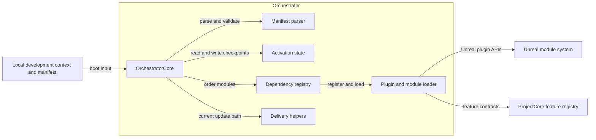

# Main View

This view shows current early-boot responsibilities, including the delivery
helper that still exists inside the component.

```mermaid
flowchart LR
    Local[Local development context and manifest] -->|boot input| Core[OrchestratorCore]

    subgraph Orchestrator[Orchestrator]
        Core -->|parse and validate| Manifest[Manifest parser]
        Core -->|read and write checkpoints| State[Activation state]
        Core -->|order modules| Registry[Dependency registry]
        Core -->|current update path| Delivery[Delivery helpers]
        Registry -->|register and load| Loader[Plugin and module loader]
    end

    Loader -->|Unreal plugin APIs| Unreal[Unreal module system]
    Loader -->|feature contracts| Feature[ProjectCore feature registry]
```
