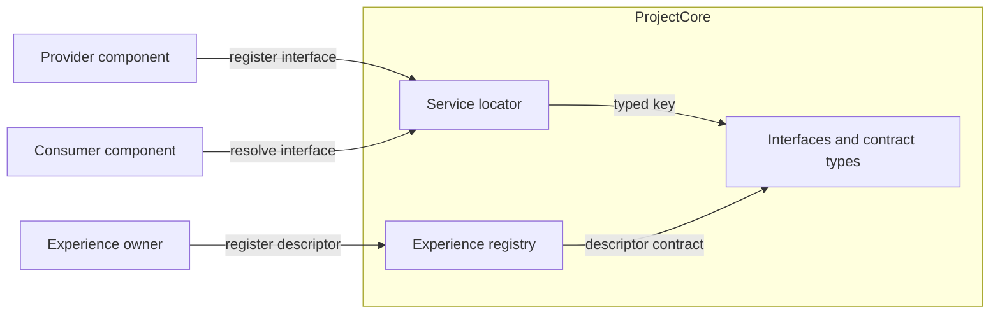

# Main View

This view shows ProjectCore as a contract and discovery owner, not as a
concrete service provider.

```mermaid
flowchart LR
    Provider[Provider component] -->|register interface| Locator[Service locator]
    Consumer[Consumer component] -->|resolve interface| Locator
    Experience[Experience owner] -->|register descriptor| Registry[Experience registry]

    subgraph ProjectCore[ProjectCore]
        Contracts[Interfaces and contract types]
        Locator -->|typed key| Contracts
        Registry -->|descriptor contract| Contracts
    end
```
