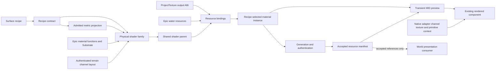

# Main component view

```mermaid
flowchart LR
    Recipe[Surface recipe] --> Contract[Recipe contract]
    Contract --> Family[Physical shader family]
    Contract --> Projection[Admitted metric projection]
    Projection --> Family
    Native[Epic material functions and Substrate] --> Family
    Layout[Authenticated terrain channel layout] --> Family
    Family --> Parent[Shared shader parent]
    Texture[ProjectTexture output ABI] --> Bindings[Resource bindings]
    Water[Epic water resources] --> Bindings
    Parent --> Bindings
    Bindings --> Instance[Recipe-selected material instance]
    Instance --> Service[Generation and authentication]
    Service --> Manifest[Accepted resource manifest]
    Instance --> Preview[Transient MID preview]
    Manifest --> Preview
    Preview --> Component[Existing rendered component]
    TerrainContext[Native adapter channel texture and primitive context] --> Component
    Manifest -->|accepted references only| World[World presentation consumer]
```

World geometry and canonical compilation are outside this authoring path. The
preview controls appearance while preserving the underlying material binding.
