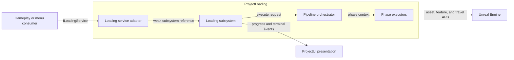

# Main View

This view separates loading execution from the components that request or
present it.

```mermaid
flowchart LR
    Caller[Gameplay or menu consumer] -->|ILoadingService| Adapter[Loading service adapter]

    subgraph ProjectLoading[ProjectLoading]
        Adapter -->|weak subsystem reference| Subsystem[Loading subsystem]
        Subsystem -->|execute request| Pipeline[Pipeline orchestrator]
        Pipeline -->|phase context| Phases[Phase executors]
    end

    Phases -->|asset, feature, and travel APIs| Unreal[Unreal Engine]
    Subsystem -->|progress and terminal events| Presentation[ProjectUI presentation]
```
