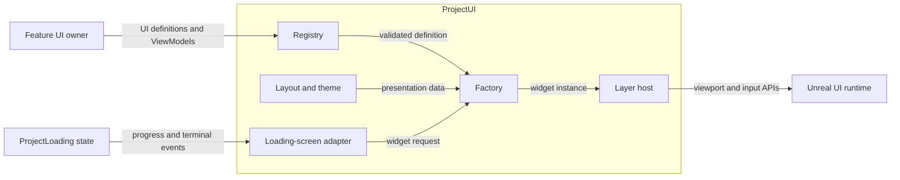

# Main View

This view shows shared UI realization and its external presentation inputs.

```mermaid
flowchart LR
    Feature[Feature UI owner] -->|UI definitions and ViewModels| Registry[Registry]

    subgraph ProjectUI[ProjectUI]
        Registry -->|validated definition| Factory[Factory]
        Factory -->|widget instance| LayerHost[Layer host]
        Layout[Layout and theme] -->|presentation data| Factory
        Loading[Loading-screen adapter] -->|widget request| Factory
    end

    LoadingState[ProjectLoading state] -->|progress and terminal events| Loading
    LayerHost -->|viewport and input APIs| Unreal[Unreal UI runtime]
```
