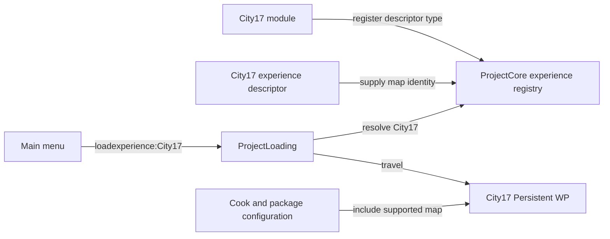

# Main View

```mermaid
flowchart LR
    Menu[Main menu] -->|loadexperience:City17| Loading[ProjectLoading]
    Module[City17 module] -->|register descriptor type| Registry[ProjectCore experience registry]
    Descriptor[City17 experience descriptor] -->|supply map identity| Registry
    Loading -->|resolve City17| Registry
    Loading -->|travel| Map[City17 Persistent WP]
    Packaging[Cook and package configuration] -->|include supported map| Map
```
