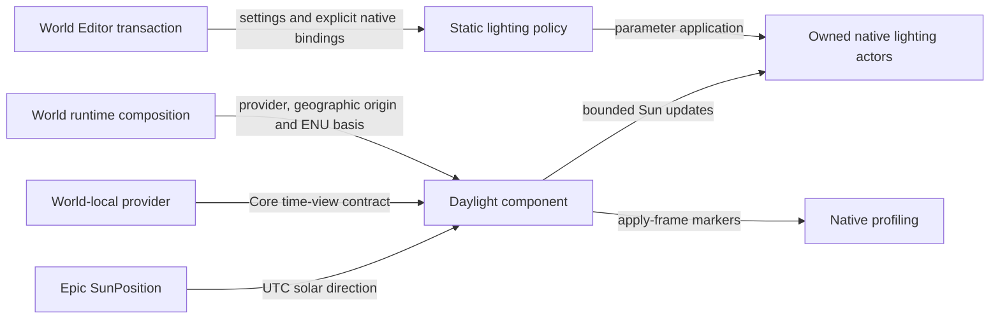

# ProjectLight main view

```mermaid
flowchart LR
    Editor[World Editor transaction] -->|settings and explicit native bindings| Policy[Static lighting policy]
    Policy -->|parameter application| Actors[Owned native lighting actors]
    World[World runtime composition] -->|provider, geographic origin and ENU basis| Controller[Daylight component]
    Time[World-local provider] -->|Core time-view contract| Controller
    Solar[Epic SunPosition] -->|UTC solar direction| Controller
    Controller -->|bounded Sun updates| Actors
    Controller -->|apply-frame markers| Trace[Native profiling]
```
