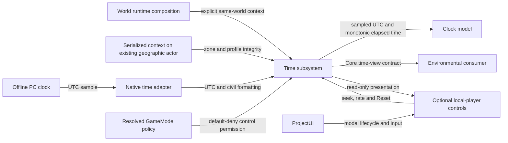

# ProjectTime main view

```mermaid
flowchart LR
    World[World runtime composition] -->|explicit same-world context| Provider[Time subsystem]
    Context[Serialized context on existing geographic actor] -->|zone and profile integrity| Provider
    Pc[Offline PC clock] -->|UTC sample| Zone[Native time adapter]
    Zone -->|UTC and civil formatting| Provider
    Provider -->|sampled UTC and monotonic elapsed time| Model[Clock model]
    Mode[Resolved GameMode policy] -->|default-deny control permission| Provider
    Provider -->|Core time-view contract| Consumer[Environmental consumer]
    UI[Optional local-player controls] -->|seek, rate and Reset| Provider
    Provider -->|read-only presentation| UI
    Framework[ProjectUI] -->|modal lifecycle and input| UI
```
