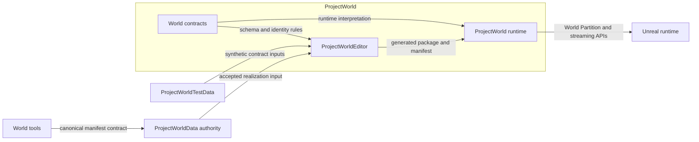

# Main View

This view shows ProjectWorld's boundary between engine-independent authority
and Unreal realization/runtime consumption.

```mermaid
flowchart LR
    Tools[World tools] -->|canonical manifest contract| Canonical[ProjectWorldData authority]
    Canonical -->|accepted realization input| Editor[ProjectWorldEditor]

    subgraph ProjectWorld[ProjectWorld]
        Editor -->|generated package and manifest| Runtime[ProjectWorld runtime]
        Contract[World contracts] -->|schema and identity rules| Editor
        Contract -->|runtime interpretation| Runtime
    end

    Runtime -->|World Partition and streaming APIs| Unreal[Unreal runtime]
    Fixtures[ProjectWorldTestData] -->|synthetic contract inputs| Editor
```
