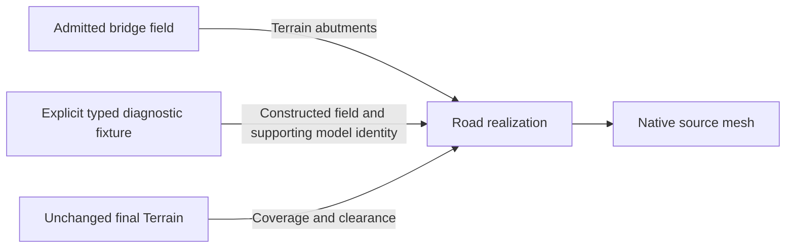

# Road elevation consumption

```mermaid
flowchart LR
    B[Admitted bridge field] -->|Terrain abutments| R[Road realization]
    F[Explicit typed diagnostic fixture] -->|Constructed field and supporting model identity| R
    T[Unchanged final Terrain] -->|Coverage and clearance| R
    R --> M[Native source mesh]
```
