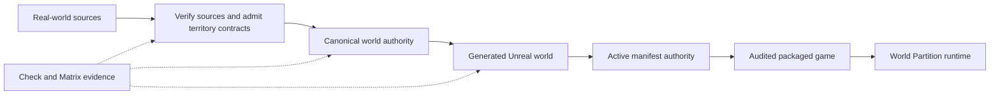
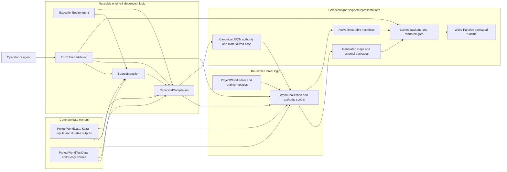
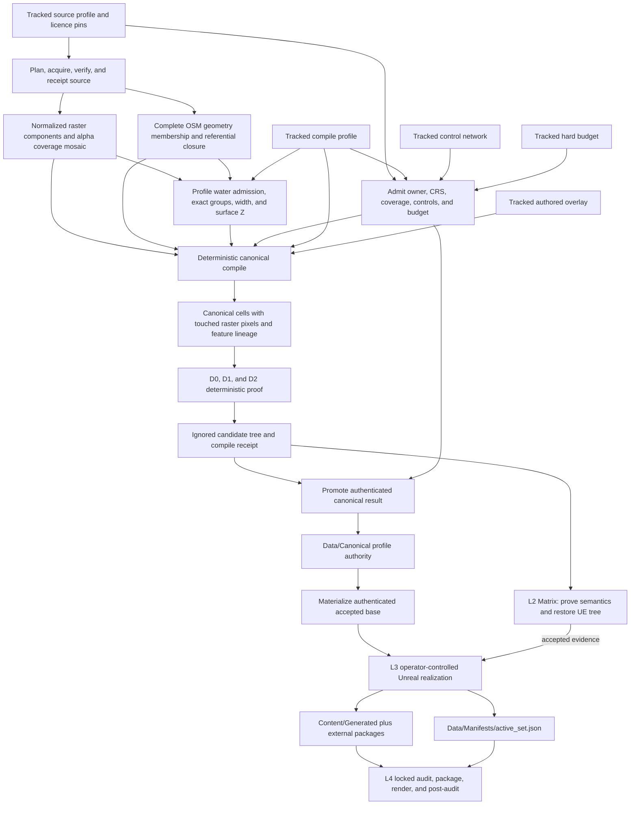
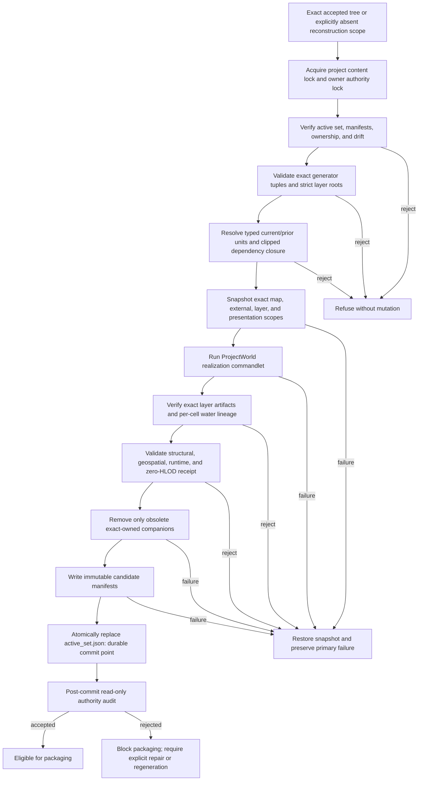
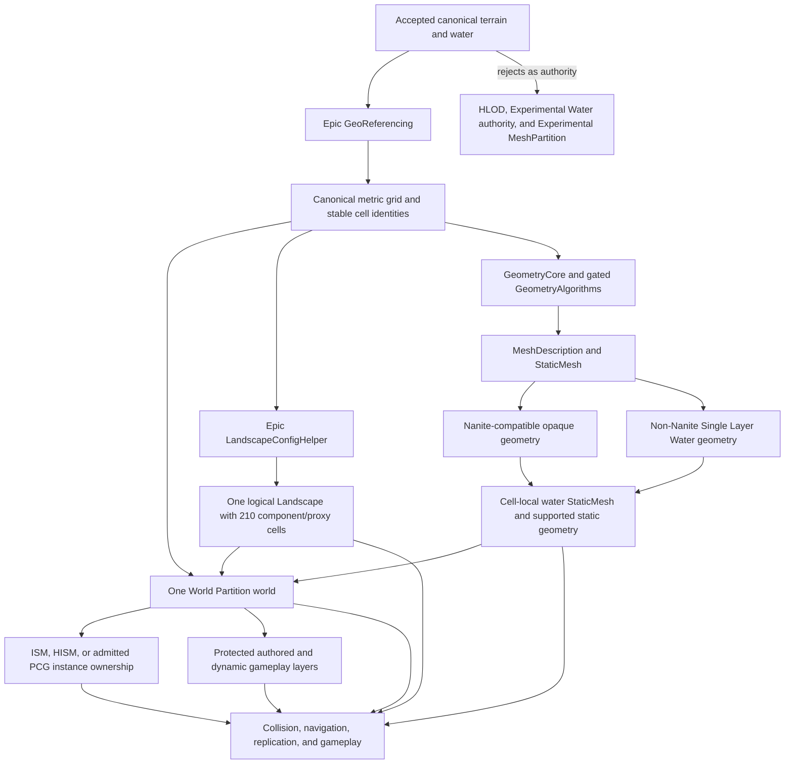
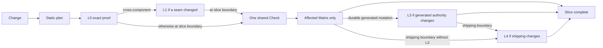

# World Reconstruction Architecture and Observability

First-read visual map for operators and fresh agents. Mermaid renders inline
with no separate architecture service. This is a navigation view, not another
SOT; exact behavior stays with linked owners. Update an owner and this view
together. World work does not require the project-wide Structurizr workspace.

Maintenance: use basic Mermaid `flowchart` syntax only. Do not add custom
themes, layout state, generated images, or click actions. Keep detailed rules
with their real owner and keep links valid.

## 1. Thirty-second golden path

Human-edited tracked inputs define intent; promoted canonical data is portable
geographic and regeneration authority; Unreal packages are derived; active
manifests authorize exact generated bytes; packaged runtime consumes only
audited accepted state.

| Authority | Exact role |
|---|---|
| Geographic and regeneration authority | `Data/Canonical/<profile_id>/active.json` plus its immutable bundle |
| Serialized Unreal authority | `Content/Generated/` and external packages authorized by `Data/Manifests/active_set.json` |

## 2. Ownership and dependency direction

Arrows show consumption, not ownership transfer. `ProjectWorld` owns reusable
Unreal interpretation; each data plugin owns its concrete inputs and outputs.
`EndToEndValidation` composes public commands and receipts without
reimplementing a stage.

| Boundary | Owner link |
|---|---|
| Reproducible Python and native tools | [Execution Environment](../../../../tools/World/ExecutionEnvironment/README.md) |
| Provider rights, acquisition, coverage, and source receipts | [Source Ingestion](../../../../tools/World/SourceIngestion/README.md) |
| Grid, cells, canonical identities, admission, and promotion | [Canonical Compilation](../../../../tools/World/CanonicalCompilation/README.md) |
| Unreal realization and runtime interpretation | [ProjectWorld](../README.md) |
| Kazan profiles and durable output | [ProjectWorldData](../../ProjectWorldData/README.md) |
| Synthetic profiles and durable fixtures | [ProjectWorldTestData](../../ProjectWorldTestData/README.md) |
| Cross-stage evidence and package acceptance | [End-to-End Validation](../../../../tools/World/EndToEndValidation/README.md) |

## 3. Data and persistence lifecycle

Persistent derived layers:

1. `Data/Canonical/<profile_id>/` holds the promoted portable bundle and
   `active.json`.
2. `Content/Generated/` plus `Data/Manifests/` holds the L3 Unreal
   representation and authority.

`tmp/world/` candidates and `Saved/Validation/` evidence are not editable
authority. Matrix may regenerate UE packages but restores the exact pre-run
tree.

## 4. Safe Unreal regeneration transaction

The active-set replacement commits. Older manifests remain immutable
provenance. Recovery and mutation live in
[Canonical World Realization](../../../../scripts/ue/world/README.md).

## 5. Runtime representation contract

This is reuse-first, not blind adoption. The Beta GeometryAlgorithms module is
Editor-only and admitted after the synthetic geometry, save, and reload proof;
packaged runtime consumes its saved assets and must still pass the later cook
gate. Experimental systems stay outside authority. Production generation also
requires zero HLOD layers, actors, proxies, companion packages, and eligible
generated actors. Exact API, fallback, and measurement rules live in
[World Partition](world_partition.md#ue-58-native-reuse-gate).

## 6. Proof layers and evidence flow

The planner selects the minimum route; L1, L3, and L4 are conditional. L0
through L2 leave no durable generated-world mutation. Exact escalation lives
in [World Pipeline Test Layers](../../../../docs/testing/world_pipeline_layers.md).

## 7. Operator observability surface

| Question | Read-only surface | Meaning |
|---|---|---|
| What proof does this diff require? | End-to-End Validation `plan` route | Static L0-L4 selection; no mutation. |
| What concrete inputs define Kazan? | [`ProjectWorldData/Data/`](../../ProjectWorldData/Data/README.md) | Tracked profiles, controls, overlays, budgets, and licences. |
| Which canonical bundle is active? | `ProjectWorldData/Data/Canonical/<profile_id>/active.json` | Persistent portable canonical authority after promotion. |
| Which Unreal artifacts are active? | [`ProjectWorldData/Data/Manifests/active_set.json`](../../ProjectWorldData/Data/Manifests/active_set.json) | Atomic current scope set and immutable manifest hashes. |
| What generations existed before? | Realization `show_generated_history` route | Read-only active, historical, and archived scope history. |
| Is the generated tree exact? | Realization `audit_generated_authority` route | Drift, ownership, consumer, and generator-fingerprint proof. |
| Is a mutation interrupted? | Owner `Data/Manifests/journal.json`, when present | Fail-closed pending transaction; use the documented recovery route. |
| Did the slice pass? | `Saved/Validation/WorldPipeline/<operation>/result.json` | Check or profile-scoped Matrix evidence, not tracked SOT. |
| Did shipping pass? | `Saved/Validation/WorldAuthority/<accept-id>/acceptance_chain.json` | Locked audit, package, IoStore, render, and post-audit chain. |
| What did the packaged GPU gate measure? | Acceptance `presentation_gate.json` and captures | Machine, GPU, RHI, cameras, samples, and p95 frame time. |

## 8. Fresh-agent route

1. Start here, then open only the owner link for the node being changed.
2. Open only the required [Territory Generation](territory_generation.md) SOT section.
3. Use the End-to-End Validation planner before choosing tests.
4. Keep candidates ignored; persist only through promotion or L3 realization.
5. Never edit receipts or immutable manifests to make a gate pass.
