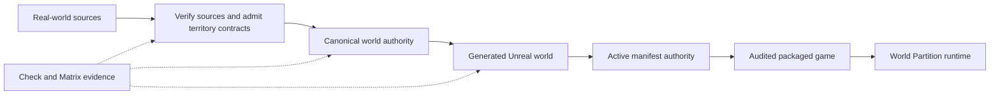
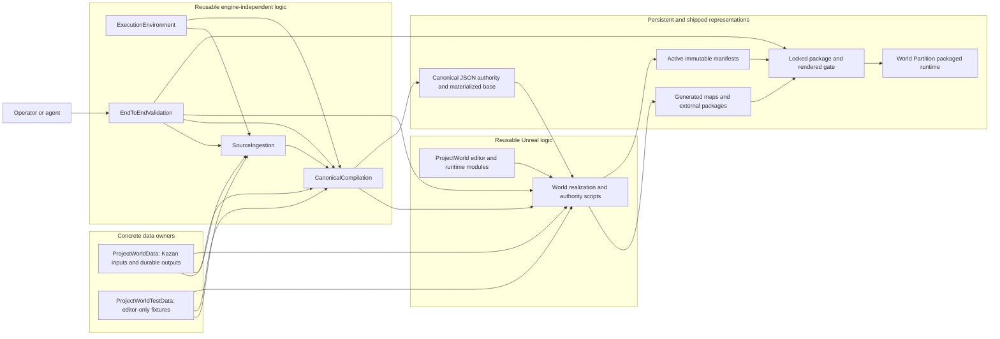
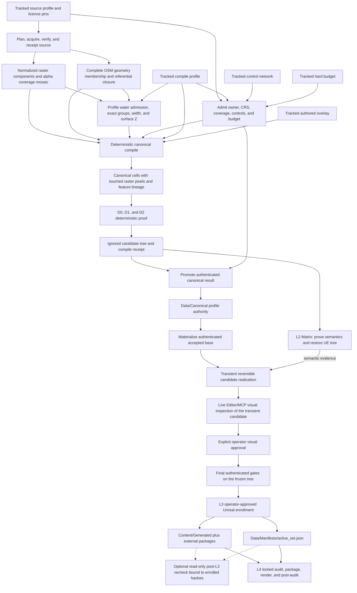
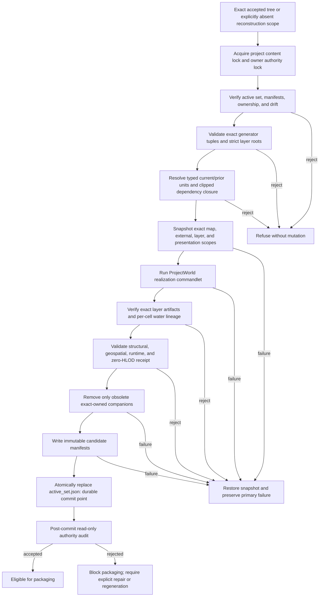
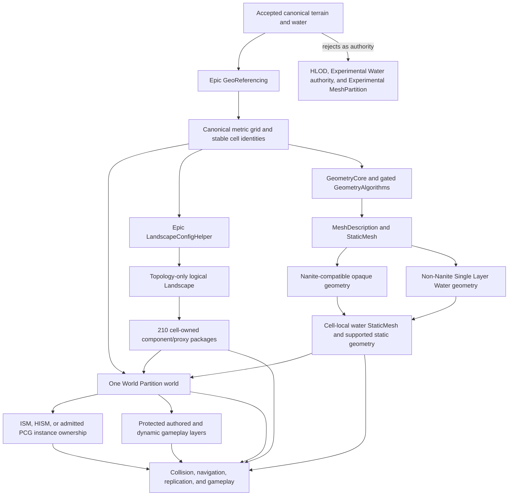
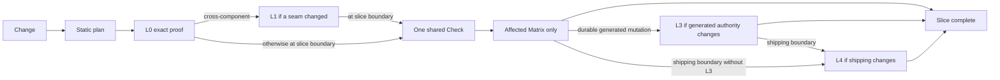

# World Reconstruction Architecture and Observability

First-read visual map for operators and fresh agents. Mermaid renders inline
with no separate architecture service. This is a navigation view, not another
SOT; exact behavior stays with linked owners. Update an owner and this view
together. World work does not require the project-wide Structurizr workspace.

Maintenance: use basic Mermaid `flowchart` syntax only. Do not add custom
themes, layout state, generated images, or click actions. Keep detailed rules
with their real owner and keep links valid.

## 1. Thirty-second golden path



Human-edited tracked inputs define intent; promoted canonical data is portable
geographic and regeneration authority; Unreal packages are derived; active
manifests authorize exact generated bytes; packaged runtime consumes only
audited accepted state.

| Authority | Exact role |
|---|---|
| Geographic and regeneration authority | `Data/Canonical/<profile_id>/active.json` plus its immutable bundle |
| Serialized Unreal authority | `Content/Generated/` and external packages authorized by `Data/Manifests/active_set.json` |

## 2. Ownership and dependency direction



Arrows show consumption, not ownership transfer. `ProjectWorld` owns reusable
Unreal interpretation; each data plugin owns its concrete inputs and outputs.
`EndToEndValidation` composes public commands and receipts without
reimplementing a stage.

| Boundary | Owner link |
|---|---|
| Reproducible Python and native tools | [Execution Environment](../../../../tools/World/ExecutionEnvironment/README.md) |
| Provider rights, acquisition, coverage, and source receipts | [Source Ingestion](../../../../tools/World/SourceIngestion/README.md) |
| Grid, cells, canonical identities, admission, and promotion | [Canonical Compilation](../../../../tools/World/CanonicalCompilation/README.md) |
| Unreal realization and runtime interpretation | [ProjectWorld](../README.md) |
| Kazan profiles and durable output | [ProjectWorldData](../../ProjectWorldData/README.md) |
| Synthetic profiles and durable fixtures | [ProjectWorldTestData](../../ProjectWorldTestData/README.md) |
| Cross-stage evidence and package acceptance | [End-to-End Validation](../../../../tools/World/EndToEndValidation/README.md) |

## 3. Data and persistence lifecycle



Persistent derived layers:

1. `Data/Canonical/<profile_id>/` holds the promoted portable bundle and
   `active.json`.
2. `Content/Generated/` plus `Data/Manifests/` holds the L3 Unreal
   representation and authority.

`tmp/world/` candidates and `Saved/Validation/` evidence are not editable
authority. Matrix may regenerate UE packages but restores the exact pre-run
tree.

## 3.1 Terrain elevation correctness

Structural evidence cannot detect wrong terrain. Cell/component/proxy counts, layer
inventories, artifact digests, and the semantic edit-layer hash are all satisfied by a
completely flat Landscape, because they answer "did Unreal produce the same terrain
again", not "did Unreal produce the terrain canonical specified".

Elevation passes through three distinct surfaces, and they can disagree:

```text
canonical terrain samples
  -> Generated Base edit layer      SOURCE. An input to UE's edit-layer blend.
                                    Read with FLandscapeEditDataInterface(info, guid),
                                    documented as "the specified edit layer".
  -> final (base) heightmap         ACCEPTANCE. The blended result that actually
                                    renders. Documented contract:
                                    ULandscapeComponent::GetHeightmap(FGuid()) returns
                                    the final (base) heightmap for an invalid GUID.
  -> cached bounds and collision    DERIVATIVE of the final surface.
```

**Verified 2026-08-17 on the Kazan territory: source and final disagreed.** The same
on-disk packages report a correct Generated Base (215,040/215,040 canonical samples,
relief 94.297 m) while every landscape proxy reports flat bounds (Z -25700..-25500, raw
height 0) and a downward line trace finds no terrain collision. Source-layer evidence is
therefore **diagnostic only** and must never accept terrain.

Current state: `terrain_source_height_*` receipt fields describe the source layer.
`terrain_final_surface_verified` is emitted as `false` because no final-surface verifier
exists yet, and L2 layered validation fails closed on that flag. Acceptance will move to
final-surface comparison; source comparison stays as the signal that distinguishes a
canonical/source defect from a composition defect.

Note that `FLandscapeEditDataInterface(info, FGuid(), ...)` is **not** a documented
final-heightmap accessor - its contract is "current/specified edit layer". Do not treat an
invalid GUID there as the final surface.

Verification is fail-closed: a Landscape-compatible canonical grid that resolves zero or
more than one generated logical Landscape is rejected rather than skipped.

GeoReferencing placement error is a separate metric and is **not** elevation evidence. It
probes cell corners and centres at a constant height origin, so it proves XY round-trip
only. A territory can report zero georeference error while every height is wrong.

Static `Validate` mode does not load the world; it is profile/contract validation. Terrain
evidence is produced by the real Apply path and authenticated downstream from its receipts.

## 3.2 Operator visual checkpoint

Visual approval precedes durable enrollment. The operator checkpoint is an
isolated, reversible candidate opened through the repository Editor/MCP route
and inspected live; explicit operator approval is required before the final
authenticated gates and the single L3 enrollment. A post-L3 MCP pass may still
be used as optional read-only verification, but it is not the approval
checkpoint. Neither pass replaces Matrix/L3 receipt authority, and neither
permits manual edits to generated packages.

## 4. Safe Unreal regeneration transaction



The active-set replacement commits. Older manifests remain immutable
provenance. Recovery and mutation live in
[Canonical World Realization](../../../../scripts/ue/world/README.md).

## 5. Runtime representation contract



This is reuse-first, not blind adoption. The Beta GeometryAlgorithms module is
Editor-only and admitted after the synthetic geometry, save, and reload proof;
packaged runtime consumes its saved assets and must still pass the later cook
gate. Experimental systems stay outside authority. Production generation also
requires zero HLOD layers, actors, proxies, companion packages, and eligible
generated actors. Exact API, fallback, and measurement rules live in
[World Partition](world_partition.md#ue-58-native-reuse-gate).

## 6. Proof layers and evidence flow



The planner selects the minimum route; L1, L3, and L4 are conditional. L0
through L2 leave no durable generated-world mutation. Exact escalation lives
in [World Pipeline Test Layers](../../../../docs/testing/world_pipeline_layers.md).

## 7. Operator observability surface

| Question | Read-only surface | Meaning |
|---|---|---|
| What proof does this diff require? | End-to-End Validation `plan` route | Static L0-L4 selection; no mutation. |
| What concrete inputs define Kazan? | [`ProjectWorldData/Data/`](../../ProjectWorldData/Data/README.md) | Tracked profiles, controls, overlays, budgets, and licences. |
| Which canonical bundle is active? | `ProjectWorldData/Data/Canonical/<profile_id>/active.json` | Persistent portable canonical authority after promotion. |
| Which Unreal artifacts are active? | [`ProjectWorldData/Data/Manifests/active_set.json`](../../ProjectWorldData/Data/Manifests/active_set.json) | Atomic current scope set and immutable manifest hashes. |
| What generations existed before? | Realization `show_generated_history` route | Read-only active, historical, and archived scope history. |
| Is the generated tree exact? | Realization `audit_generated_authority` route | Drift, ownership, consumer, and generator-fingerprint proof. |
| Is a mutation interrupted? | Owner `Data/Manifests/journal.json`, when present | Fail-closed pending transaction; use the documented recovery route. |
| Did the slice pass? | `Saved/Validation/WorldPipeline/<operation>/result.json` | Check or profile-scoped Matrix evidence, not tracked SOT. |
| Did shipping pass? | `Saved/Validation/WorldAuthority/<accept-id>/acceptance_chain.json` | Locked audit, package, IoStore, render, and post-audit chain. |
| What did the packaged GPU gate measure? | Acceptance `presentation_gate.json` and captures | Machine, GPU, RHI, cameras, samples, and p95 frame time. |

## 8. Fresh-agent route

1. Start here, then open only the owner link for the node being changed.
2. Open only the required [Territory Generation](territory_generation.md) SOT section.
3. Use the End-to-End Validation planner before choosing tests.
4. Keep candidates ignored; persist only through promotion or L3 realization.
5. Never edit receipts or immutable manifests to make a gate pass.
