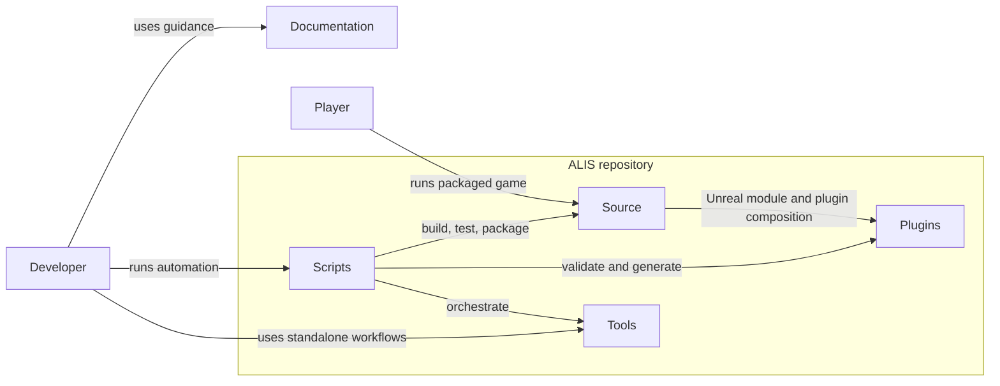

# Main View

This view shows project-level owners only. Each component owns its internal
relationships in its own architecture directory.

```mermaid
flowchart LR
    Player[Player] -->|runs packaged game| Game[Source]
    Developer[Developer] -->|uses guidance| Docs[Documentation]
    Developer -->|runs automation| Scripts[Scripts]
    Developer -->|uses standalone workflows| Tools[Tools]

    subgraph Repository[ALIS repository]
        Game -->|Unreal module and plugin composition| Plugins[Plugins]
        Scripts -->|build, test, package| Game
        Scripts -->|validate and generate| Plugins
        Scripts -->|orchestrate| Tools
    end
```
