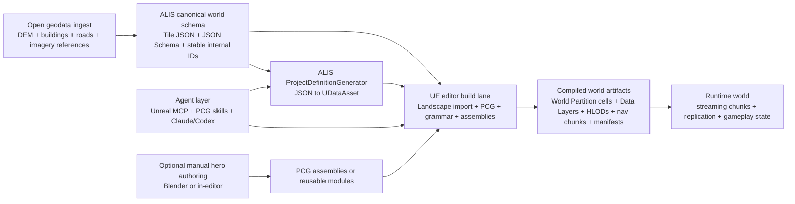

# Open-World ALIS Architecture for Agent-Driven Real-World Generation in Unreal Engine

> Status: Imported agentic research draft. Numbered source links were recovered
> from the source PDF on 2026-07-21. Validate material claims against current
> primary sources before promoting any conclusion into ALIS architecture
> documentation.

**Verdict:** ALIS should **double down on its existing JSON-first philosophy** and treat Unreal as a **compiled projection layer** for editor automation, partition baking, and runtime streaming, not as the canonical world database. The fastest future-proof path is a stack built around **ALIS tile JSON + schema-driven DataAsset generation + World Partition + PCG + Epic's new Unreal MCP/PCG skills**, with heavy geospatial preprocessing kept **outside** Unreal and only the final world artifacts baked into partitioned UE content. That direction matches the current ALIS repo design, which already frames world data as **patterns and constraints rather than hand-placed props**, uses **one data file per tile**, and has a **schema-driven JSON -> UDataAsset generator with incremental rebuilds**. [[1]](https://github.com/<user>/alis/blob/main/Plugins/World/ProjectWorld/README.md)

## What ALIS already gets right

ALIS is already surprisingly close to the right architecture for a long-lived open-world system. In `ProjectWorld`, the repo explicitly says world data should describe **where buildings are, where roads are, what zones/biomes exist, which presets should be used, and what densities/variations apply**, while avoiding a giant JSON list of every lamp, bush, or prop. That is exactly the right abstraction for agentic generation: agents are good at editing structured, high-level data, and bad at micromanaging raw mesh transforms. [[2]](https://github.com/<user>/alis/blob/main/Plugins/World/ProjectWorld/README.md)

The same plugin also states that terrain should come from **one continuous "mother" heightmap**, then be sliced into grid-aligned tiles so streaming pieces still fit perfectly. It explicitly ties the terrain, zone data, and PCG together, with agents operating on rules like zone type and density instead of raw vertex heights. That directly aligns with Unreal's World Partition plus partitioned PCG model. [[3]](https://github.com/<user>/alis/blob/main/Plugins/World/ProjectWorld/README.md)

Your `ProjectDefinitionGenerator` plugin is the other key asset. It already defines a **schema-driven JSON -> DataAsset pipeline** where schemas declare an `x-alis-generator` block, the generator performs parsing and field mapping, mirrors folder hierarchy, tracks source hashes, supports incremental regeneration, and cleans up orphans. In other words, ALIS already has the "compiler front end" for the world. The report below therefore recommends **extending this generator**, not replacing it. [[4]](https://github.com/<user>/alis/blob/main/Plugins/Editor/ProjectDefinitionGenerator/README.md)

The practical conclusion is simple: **keep ALIS JSON as the source of truth, keep generation deterministic, and let Unreal own only the projection and runtime representation.** That is the strategy most compatible with scalability, open collaboration, and later server-driven infinite streaming. [[5]](https://github.com/<user>/alis/blob/main/Plugins/World/ProjectWorld/README.md)

## Recommended architecture for ALIS

The highest-value architecture is a **two-plane system**.

The **authoring plane** lives mostly outside Unreal. It ingests open geospatial data, normalizes it into ALIS tile JSON, validates it against schemas, and assigns stable internal IDs. For open building and road data, Overture is especially attractive because it is explicitly **free and open**, exposes **stable IDs**, supports area-based download, and has structured themes for **buildings** and **transportation**. Its buildings theme exposes footprints plus `height`, `num_floors`, and `BuildingPart` relationships, which is enough to drive first-pass "DNA" buildings. Its transportation schema represents roads as LineString segments with structured attributes. For terrain, OpenTopography exposes open elevation APIs and states its data are available under open and permissible licenses. [[6]](https://overturemaps.org/)

The **projection plane** lives in Unreal Editor. It imports tiled heightmaps into Landscape/World Partition, converts validated JSON into DataAssets, runs PCG graphs and shape grammars, bakes heavy outputs offline, and emits partition-ready content. Unreal's World Partition gives you automatic grid-based streaming for a single persistent world; PCG is explicitly designed for content ranging from building utilities up to entire worlds; PCG can also work with World Partition Data Layers and HLOD Layers; and Unreal 5.4 added a **PCG World Partition Builder** for command-line/offline generation on a build machine. [[7]](https://dev.epicgames.com/documentation/unreal-engine/world-partition-in-unreal-engine)

At runtime, ALIS should stream **compiled chunks**, not synthesize the whole city live. A reasonable extension of your current architecture is to have the server stream **tile manifests, gameplay deltas, and runtime state**, while the client loads the corresponding World Partition cells and Data Layers. This fits Unreal's large-world direction: World Partition handles streaming by distance, Runtime Data Layers can toggle content from Blueprint/C++, dedicated-server streaming support was added in UE 5.4, and World Partition's newer runtime hash was designed to be expandable for project-specific requirements. That is the right foundation for an eventually "infinite" world without rebuilding the core again later. [[8]](https://dev.epicgames.com/documentation/unreal-engine/world-partition-in-unreal-engine)

This diagram is not a claim about an existing Epic sample; it is the **recommended composition** derived from ALIS's JSON-first design and Unreal's current world-building toolchain. [[9]](https://github.com/<user>/alis/blob/main/Plugins/World/ProjectWorld/README.md)

## Critical must-have tools and plugins

The table below is intentionally opinionated. It prioritizes **tools you should build around**, not every interesting plugin in the ecosystem.

| Priority | Tool or plugin | Recommendation for ALIS | Why it matters |
|---|---|---|---|
| **Core** | **ALIS ProjectWorld + ProjectDefinitionGenerator** | **Keep and extend** | These already encode the right philosophy: one tile data file, patterns-not-props, JSON schemas with `x-alis-generator`, incremental JSON->DataAsset generation, and typed world loading. This is the correct ALIS-specific foundation. [[10]](https://github.com/<user>/alis/blob/main/Plugins/World/ProjectWorld/README.md) |
| **Core** | **World Partition + Data Layers + HLOD** | **Mandatory** | World Partition is Unreal's large-world management system; Data Layers are a major tool for conditional loading and runtime switching; HLOD keeps distant unloaded cells visible while reducing draw calls. UE 5.4 also added dedicated-server streaming and a more extensible runtime hash. [[11]](https://dev.epicgames.com/documentation/unreal-engine/world-partition-in-unreal-engine) |
| **Core** | **Landscape with tiled heightmap import** | **Mandatory** | Unreal supports tiled heightmaps with World Partition grid and region settings. This maps directly to ALIS's "one big heightmap, many streamed pieces" model. [[12]](https://dev.epicgames.com/documentation/unreal-engine/importing-and-exporting-landscape-heightmaps-in-unreal-engine) |
| **Core** | **PCG Framework** | **Mandatory** | Epic positions PCG as a framework for building content from asset utilities up to entire worlds. Partitioned generation, hierarchical generation, runtime generation, Data Layer/HLOD interoperability, graph instances, and offline builders make it the best out-of-box engine-native generator for ALIS. [[13]](https://dev.epicgames.com/documentation/unreal-engine/procedural-content-generation-framework-in-unreal-engine) |
| **Core** | **PCG Shape Grammar + PCG Assemblies** | **Mandatory for buildings** | Shape Grammar is the cleanest fit for "DNA buildings" because it encodes rule-driven module composition. PCG Assemblies and "Level to PCG Data Asset" let you capture manually authored hero content and re-use it procedurally; Epic explicitly notes this workflow was used in Electric Dreams and Lego Fortnite. [[14]](https://dev.epicgames.com/documentation/unreal-engine/using-shape-grammar-with-pcg-in-unreal-engine) |
| **Core** | **Unreal MCP + PCG toolset + PCG skills** | **Best agent layer if you can target UE 5.8** | Epic now ships a built-in Unreal MCP server in the editor, generates config for Claude Code/Codex/Cursor/Gemini/VS Code, and provides dedicated PCG workflows. Epic's own guidance says the **PCG toolset and PCG graph generation skill** should be loaded first, and that these skills are mandatory for reliable PCG graph work. [[15]](https://dev.epicgames.com/documentation/unreal-engine/unreal-mcp-in-unreal-editor) |
| **Core** | **Editor Scripting Utilities + Python + PythonAutomationTest + UAT/BuildGraph + Horde** | **Mandatory for CI and safe generation** | Editor Scripting Utilities is Epic's recommended base for editor automation; Python lets you script editor tasks; PythonAutomationTest turns Python scripts into discoverable tests; UAT provides automation/build orchestration; Horde is Epic's own workflow infrastructure. Together they let you run generation/validation in build lanes instead of by hand. [[16]](https://dev.epicgames.com/documentation/unreal-engine/scripting-and-automating-the-unreal-editor) |
| **Core** | **GeoReferencing** | **Mandatory if ALIS wants real coordinates** | This built-in plugin lets Unreal express real geographic coordinates such as lat/long or UTM. For real-world ALIS, this is the correct way to keep ingest, simulation, and future chunk services geospatially sane. [[17]](https://dev.epicgames.com/documentation/unreal-engine/georeferencing-a-level-in-unreal-engine) |
| **Strong accelerator** | **SlateInspectorToolset** | **Use with Unreal MCP** | Epic describes it as Playwright-style Slate UI automation and notes it is automatically discovered by the MCP plugin. This is valuable when agents must drive editor UI workflows that are not yet covered by stable direct tools. [[18]](https://dev.epicgames.com/documentation/unreal-engine/API/Plugins/SlateInspectorToolset/USlateInspectorToolset) |
| **Strong accelerator** | **PCGEx** | **Best third-party PCG extension** | PCGEx is MIT-licensed, actively released, supports UE 5.3-5.8, has 200+ nodes, and fills a real gap in vanilla PCG with graph theory, pathfinding, topology, polygon operations, and advanced clustering. For roads, parceling, block decomposition, and relationship-aware generation, it is the strongest third-party add-on in this space. [[19]](https://github.com/PCGEx/PCGExtendedToolkit) |
| **Strong accelerator** | **soft-ue-cli** | **Best open-source fallback for agent CI and terminal-first workflows** | MIT-licensed, updated in July 2026, explicitly built for Claude Code/MCP/CLI workflows, and offers broad editor control plus CLI use in scripts and CI/CD. It is a good fallback or supplement when official Unreal MCP coverage is not enough, especially for terminal-first Linux workflows. [[20]](https://github.com/softdaddy-o/soft-ue-cli) |
| **Strong accelerator** | **ChiR24 Unreal_mcp** | **Good open-source fallback if you need a native bridge before or beyond UE 5.8** | MIT-licensed, actively released in 2026, broad editor/asset/actor control, optional native MCP transport, and explicit Claude/Cursor integration. Compared with the official plugin it is less canonical, but today it is one of the strongest open-source Unreal MCP servers. [[21]](https://github.com/ChiR24/Unreal_mcp) |
| **Conditional** | **Remote Control API** | **Use as a compatibility shim, not your main long-term control plane** | Remote Control gives JSON/HTTP/WebSocket control and is still useful for custom bridges and older engine versions, but Epic marks it Beta and it is more property/preset oriented than the new Unreal MCP workflow. [[22]](https://dev.epicgames.com/documentation/unreal-engine/remote-control-api-websocket-reference-for-unreal-engine) |
| **Conditional** | **OpenUSD support in UE** | **Use as an interchange lane, not the source of truth** | Unreal supports USD through the USD Stage panel and bidirectional Python workflows, and OpenUSD itself is an efficient, scalable interchange and scene description system. That makes USD valuable for Blender/DCC exchange and late-stage assembly reuse, but ALIS should keep JSON as the canonical world model. [[23]](https://dev.epicgames.com/documentation/unreal-engine/universal-scene-description-in-unreal-engine) |
| **Conditional** | **Cesium for Unreal** | **Prototype/reference layer for massive geospatial streaming, not ALIS core dependency** | Cesium for Unreal is Apache-2.0, streams real-world geospatial content, uses open standards such as 3D Tiles, and integrates tightly with Unreal. It is excellent for reference implementations or rapid planet-scale prototypes, but ALIS should avoid coupling its own canonical world model to external service assumptions. [[24]](https://github.com/CesiumGS/cesium-unreal) |

A few things are worth **not** centering your architecture on. `UnrealGDAL` is MIT-licensed, but the public repo shows only **3 commits** and its latest release is from **August 2020**, with multiple long-open build issues. `GeotiffLandscape` is interesting, but its README says UE5 support only goes **up to 5.1** and labels itself **experimental research code**. `Landscape Combinator` is useful as a prototype accelerator, but its distribution and license posture are less clean for a long-lived open foundation than the pure Epic-first path above. For ALIS, those are prototype helpers, not bedrock. [[25]](https://github.com/TensorWorks/UnrealGDAL)

## Recommended integration flow from JSON to streaming chunks

The cleanest ALIS flow is:

**Ingest open geodata outside Unreal.** Fetch terrain from open elevation sources and vector context from open map datasets. Overture already supports area downloads, stable global schemas, buildings with approximate 3D fields, and transportation segments; OpenTopography exposes open elevation APIs. This external ingest stage should normalize everything into ALIS tile JSON and maintain internal IDs independent of upstream provider IDs. That preserves the ability to switch data sources later without rewriting the engine side. [[26]](https://docs.overturemaps.org/getting-data/)

**Validate and compile tile JSON into ALIS DataAssets.** Keep `ProjectDefinitionGenerator` as the compiler from schemas + tile JSON into editor-usable DataAssets. Extend it with world-specific definition types such as `TerrainTileDefinition`, `RoadNetworkDefinition`, `BuildingDefinition`, `ZoneDefinition`, and `LandmarkAssemblyDefinition`. Because the generator already supports field mappings, versions, hashes, and orphan cleanup, it is the correct place to implement "DNA" building types and tile manifests. [[4]](https://github.com/<user>/alis/blob/main/Plugins/Editor/ProjectDefinitionGenerator/README.md)

**Import terrain as tiled landscapes under World Partition.** Use the continuous master heightmap approach ALIS already prefers, then slice/export it as UE-compatible tiled heightmaps. Unreal explicitly supports tiled heightmap import with World Partition grid and region settings. Terrain should be mostly editor-built and runtime-streamed, not procedurally sculpted on demand. [[27]](https://github.com/<user>/alis/blob/main/Plugins/World/ProjectWorld/README.md)

**Generate roads, lots, and buildings through PCG, not actor spam.** Roads should begin as line-based source geometry in JSON and become splines, meshes, lane logic, and exclusion masks inside PCG. Buildings should begin as compact specs such as footprint, floors, height, class, facade grammar, roof grammar, entrance, material palette, seed, and streaming priority. Then use PCG Shape Grammar for linear/composed modules, PCG attribute-driven logic for parameterization, and PCG Assemblies when you want hand-authored hero content to become reusable modules. For more topological tasks such as parcel splitting, road graph operations, routing, or block subdivision, use PCGEx. [[28]](https://github.com/<user>/alis/blob/main/Plugins/World/ProjectWorld/README.md)

**Bake heavy generation offline.** This is critical. Use the PCG World Partition Builder, commandlets, UAT, and CI to generate content on build machines. Keep runtime PCG for lighter local variation, not for whole-city synthesis. Epic's documentation explicitly positions the PCG world partition builder as build-machine friendly, and Unreal MCP guidance also warns that broad graph analysis and large dataset inspection are expensive enough to require careful supervision and Dataview workflows. [[29]](https://dev.epicgames.com/documentation/unreal-engine/unreal-engine-5.4-release-notes?application_version=5.4)

**Publish chunk artifacts, then stream them.** The output of the editor build lane should be versioned World Partition content, Data Layer assignments, optional HLODs, nav chunks, and a manifest that the ALIS backend can reason about. For server-fed infinite-world extensions, use Runtime Data Layers and, when mature enough for your project, consider External Data Layers/Game Feature activation patterns for plugin-injected world slices. That is the cleanest path from "big finite city" to "continuously streamed real world." [[30]](https://dev.epicgames.com/documentation/unreal-engine/world-partition---data-layers-in-unreal-engine)

One practical implication follows from this flow: **do not make runtime replication equal world reconstruction**. Replicate gameplay-relevant changing state, not every static building decision. Static space should mostly arrive as compiled streamed content; the network should carry deltas, events, and dynamic actors. Unreal's server-streaming and partition systems support that direction. [[31]](https://dev.epicgames.com/documentation/unreal-engine/unreal-engine-5.4-release-notes?application_version=5.4)

## How agentic support should actually be used

The big opportunity is not "let the agent make the city from scratch." The big opportunity is to use agents where they are already strongest: **editor automation, graph assembly, schema editing, batch validation, and incremental rebuild orchestration**. Epic's own Unreal MCP documentation is very clear that the best PCG workflows are collaborative, reference-driven, and iterative, and that the PCG toolset plus PCG graph generation skill should be loaded first. It also explicitly recommends grounding the model in existing example graphs and keeping it inside well-defined tasks. [[32]](https://dev.epicgames.com/documentation/unreal-engine/working-with-pcg-and-llms-using-unreal-mcp-in-unreal-engine)

For ALIS, that means agents should mostly be assigned tasks like these: modify tile JSON, generate or refactor DataAsset schemas, create or duplicate PCG graphs from examples, connect graph parameters to known attributes, run headless rebuilds, inspect failures, and validate generated content against tests. Those are stable, high-leverage actions. By contrast, asking an agent to invent large city graphs from a blank slate, browse the whole project autonomously, or live-edit giant worlds without references is exactly the failure mode Epic warns about. [[33]](https://dev.epicgames.com/documentation/unreal-engine/working-with-pcg-and-llms-using-unreal-mcp-in-unreal-engine)

The best current control-plane stack is therefore:

- **Primary:** official **Unreal MCP** on UE 5.8, with its PCG toolset, PCG skills, and Slate inspector integration. [[34]](https://dev.epicgames.com/documentation/unreal-engine/unreal-mcp-in-unreal-editor)
- **Secondary:** **soft-ue-cli** for terminal-first use, CI scripting, or gaps in Epic's current tool surface. [[20]](https://github.com/softdaddy-o/soft-ue-cli)
- **Fallback:** **ChiR24 Unreal_mcp** for projects that need a strong open-source bridge before or beyond first-party coverage. [[21]](https://github.com/ChiR24/Unreal_mcp)

If you adopt this, your agents become **world compiler operators**, not fantasy city gods. That is exactly what a long-term open project needs. [[35]](https://github.com/<user>/alis/blob/main/Plugins/World/ProjectWorld/README.md)

## Risks and mitigations

The biggest technical risk is **putting too much generation at runtime**. Unreal's PCG supports runtime generation, but for ALIS-scale environment synthesis the safer pattern is to bake terrain, roads, and most building structure offline, then use runtime generation only for local variation, biome detail, or near-player decoration. The mitigation is simple: put large PCG jobs behind commandlets and CI, and treat runtime PCG as an optimization/variation layer. [[36]](https://dev.epicgames.com/documentation/unreal-engine/using-pcg-generation-modes-in-unreal-engine)

The second risk is **over-coupling to experimental Epic AI features too early**. Unreal MCP, Semantic Search, and parts of the PCG/Geometry scripting stack are marked Experimental or Beta. They are still worth using because Epic is clearly investing in them, but your architecture should keep a narrow integration surface: agents operate on schemas, graphs, and deterministic editor tools, while the world source of truth stays in ALIS JSON. That way, if Unreal MCP changes, you replace only the control layer, not the data model. [[37]](https://dev.epicgames.com/documentation/unreal-engine/API/PluginIndex/ModelContextProtocol)

The third risk is **data-license contamination**. Overture buildings are under ODbL because of OSM lineage, OSM itself is ODbL, and open elevation sources can have separate attribution conditions. The mitigation is to make licensing a first-class ingest concern: record provenance per tile, preserve attribution metadata, and keep ALIS internal IDs separate from upstream IDs. If you later switch providers or split open/community distributions from proprietary/private builds, that metadata trail will matter. [[38]](https://docs.overturemaps.org/guides/buildings/)

The fourth risk is **choosing stale geospatial UE plugins as core dependencies**. The maintenance signals are mixed: some older GIS plugins are experimental, version-lagged, or effectively dormant. The mitigation is to keep most heavy geospatial preprocessing outside Unreal, then hand Unreal normalized JSON and engine-native import artifacts. In other words, use Unreal for world compilation, not for every raw GIS transformation. [[39]](https://github.com/TensorWorks/UnrealGDAL)

The fifth risk is **trying to jump directly to "the whole real world"**. The better sequence is: first make **terrain + georeferencing + roads + placeholder buildings + partition baking** work for one serious region; second add grammar-driven buildings and assembly capture; third add server-driven chunk manifests and runtime layer activation; only then move toward broad geographic scale. That sequencing is consistent with ALIS's current architecture and with the lessons in recent digital-twin research, which emphasize reproducible, extensible, parallelizable pipelines combining open map data, elevation, and procedural generation rather than monolithic in-engine magic. [[40]](https://github.com/<user>/alis/blob/main/Plugins/World/ProjectWorld/README.md)

In short, the **best big-picture design for ALIS** is:

1. **Canonical world truth:** open-data ingest -> ALIS tile JSON + schemas. [[41]](https://docs.overturemaps.org/getting-data/)
2. **Compiler layer:** ALIS generator plugins turn JSON into typed UE assets incrementally. [[42]](https://github.com/<user>/alis/blob/main/Plugins/Editor/ProjectDefinitionGenerator/README.md)
3. **World builder:** World Partition + Landscape + PCG + Shape Grammar + Assemblies build the playable world offline. [[43]](https://dev.epicgames.com/documentation/unreal-engine/world-partition-in-unreal-engine)
4. **Agent layer:** official Unreal MCP/skills first, open-source MCP/CLI tools as backup, always supervised and reference-driven. [[44]](https://dev.epicgames.com/documentation/unreal-engine/unreal-mcp-in-unreal-editor)
5. **Runtime:** stream compiled chunks, not raw world reconstruction instructions. [[45]](https://dev.epicgames.com/documentation/unreal-engine/unreal-engine-5.4-release-notes?application_version=5.4)

That architecture is the most **industrial**, the most **open-project friendly**, and the least likely to force ALIS into a painful rebuild later.
