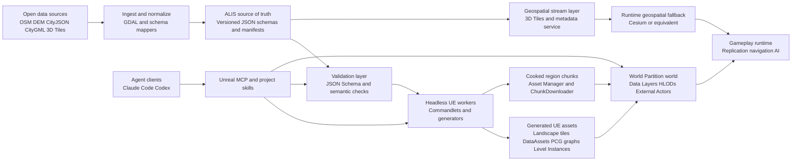
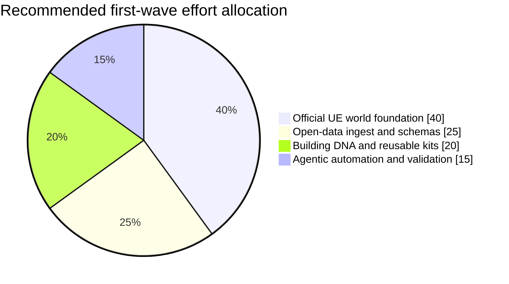

# Open World ALIS with Agentic Unreal

> Status: Imported Unreal Engine capabilities research draft. Numbered source
> links were recovered from the source PDF on 2026-07-21. Validate material
> claims against current primary sources before promoting any conclusion into
> ALIS architecture documentation.

## Executive Summary

The strongest path for ALIS is **not** to invent a new world-building stack from scratch. It is to extend the architecture you already have: keep **JSON as the source of truth**, treat **uassets as generated engine projections**, and let **UE 5.8's official systems** do the heavy lifting for streaming, procedural placement, and editor automation. In practice, that means: **Unreal MCP + Toolset Registry** for agent control, **World Partition + Data Layers + HLOD + OFPA** for large-world streaming, **Landscape + Georeferencing + Large World Coordinates** for terrain and coordinates, **PCG + Shape Grammar + Level Instancing** for buildings and roads, and **Asset Manager + chunks + ChunkDownloader** for cooked distribution. That foundation is more future-proof than a custom all-runtime authoring stack because it aligns with Epic's own large-world, chunking, and automation model while staying compatible with ALIS's current JSON->DataAsset pipeline. [[1]](https://github.com/<user>/alis/blob/main/Plugins/Editor/ProjectDefinitionGenerator/README.md)

For the "real world in 3D" goal, the best high-level design is a **hybrid world system**. Use **open geospatial standards and public/licensed data** as your upstream truth, normalize them into ALIS schemas, and then generate native UE content only where native gameplay value matters. For global or near-global scale, stream coarse geospatial content using **3D Tiles** and georeferenced coordinates; for near-player and gameplay-critical zones, convert the same source data into native UE terrain, roads, building DNA, and chunked cooked assets. This avoids trying to bake the planet into native Unreal assets while still giving you native replication, gameplay, collisions, and editor workflows where they matter most. The key third-party addition is **Cesium for Unreal** because it brings open-standard geospatial streaming, WGS84-scale coordinates, private-network content support, and Unreal integration. The key agent operators are **Claude Code** and **Codex**, with official MCP support on both sides. [[2]](https://www.ogc.org/standards/3dtiles/)

A critical validation point: do **not** plan around tracing Google satellite or Street View imagery into your own terrain, roads, or buildings. Google's current terms explicitly prohibit scraping Google Maps content for use outside the services and prohibit creating content from Google Maps content, including tracing roadways or building outlines and creating terrain or 3D building models from that content. For ALIS, that makes open/public/licensed datasets a strategic necessity, not just a preference. [[3]](https://cloud.google.com/terms/maps-platform/eea)

## What the ALIS repo already gets right

ALIS already has the right core philosophy for a scalable world system. Your `ProjectDefinitionGenerator` is an **editor-only JSON-to-DataAsset generator** that treats JSON schemas and source files as the canonical input, then performs parsing, mapping, incremental generation, and orphan cleanup into Unreal assets. [[4]](https://github.com/<user>/alis/blob/main/Plugins/Editor/ProjectDefinitionGenerator/README.md) The repo's data docs also define a clean three-stage flow-**SYNC**, **GENERATION**, and **PROPAGATION**-which is exactly the right separation for an industrial world pipeline: mechanical asset path maintenance, one-way validated generation, and scene propagation should stay distinct. [[5]](https://github.com/<user>/alis/blob/main/docs/data/README.md)

The boot/orchestration side of ALIS also supports this direction. The Orchestrator plugin is explicitly about **code/module lifecycle**, rollback, and plugin dependency order, while external tooling is separated into `Plugins/ThirdParty/` for tracked shared dependencies and `Plugins/Local/` for machine-local editor tooling. That is exactly the right boundary for agentic world-building: stable, validated dependencies go into tracked third-party roots; fast-moving experimental agent tools stay in local/editor-only roots until proven. [[6]](https://github.com/<user>/alis/blob/main/Plugins/Boot/Orchestrator/README.md)

## Recommended target architecture

The recommended architecture is a **dual-plane system**: an **authoring plane** for schemas, processing, validation, generation, and chunk cooking; and a **runtime plane** for streaming, mounting, loading, and gameplay. JSON and open geospatial data remain authoritative. Unreal assets remain projections optimized for engine capabilities. Agents sit on top of the authoring plane, not inside the shipped game. That keeps the shipped runtime simpler, safer, and more compatible with Unreal's content model. This is also the cleanest way to preserve ALIS's existing repo philosophy. [[7]](https://github.com/<user>/alis/blob/main/Plugins/Editor/ProjectDefinitionGenerator/README.md)

The practical reading of this diagram is simple. **Far-scale reality** is served from open geospatial services and tile stores. **Near-scale gameplay reality** is generated into native Unreal assets and World Partition cells. Agents use MCP and skills to automate editor work, schema migrations, placement jobs, and validations, but they do not become the runtime. That is the fastest path that is still durable. It maximizes reuse of Epic systems, minimizes bespoke runtime tech, and gives you a credible road from prototype to industrial pipeline. [[8]](https://www.ogc.org/standards/3dtiles/)

This allocation is a recommendation, not a published Epic recipe. It follows the maturity of the underlying systems: large-world streaming and chunking are already production-grade in Unreal, open-data normalization is mandatory for lawful and scalable real-world reconstruction, reusable building DNA determines long-term content leverage, and agentic tooling should accelerate the workflow without becoming the foundation itself. [[9]](https://dev.epicgames.com/documentation/unreal-engine/world-partition-in-unreal-engine)

## Critical tools and integrations

All Epic-built features below are governed by the Unreal Engine license/EULA. [[10]](https://www.unrealengine.com/license)

| Tool or stack | Primary role | ALIS integration points | Maturity and validation | License | Priority |
| --- | --- | --- | --- | --- | --- |
| **Unreal MCP + Toolset Registry** | Primary official agent control surface for the editor | Expose ALIS generators, schema validators, placement repairs, PCG utilities, and inspection tools as C++ or Python toolsets; keep toolsets small and typed | Official in UE 5.8; runs tool calls serially on the game thread; loopback-only by default; authored toolsets are reusable across other Unreal AI surfaces, which makes this the most future-proof MCP foundation. [[11]](https://dev.epicgames.com/documentation/unreal-engine/unreal-mcp-in-unreal-editor) | UE EULA | **P0** |
| **World Partition + OFPA + Data Layers + HLOD + builder commandlets** | Core large-world storage, streaming, and batch automation | World cells, region generation, external actors, per-cell HLOD builds, data-layer-based world states, automated rebuild jobs in CI | Production large-world system; grid-cell streaming, OFPA collaboration, HLOD builders, and commandlets are all first-party building blocks for huge maps. [[12]](https://dev.epicgames.com/documentation/unreal-engine/world-partition-in-unreal-engine) | UE EULA | **P0** |
| **Landscape + Georeferencing + Large World Coordinates** | Base terrain and coordinate correctness at scale | DEM -> heightmap tiles -> Landscape proxies; CRS conversion for server manifests and placement; integer-aligned origin choices; ENU/ECEF conversions | Official and highly relevant for real-world terrain; Landscape integrates natively with World Partition; Georeferencing converts among Unreal, projected, geographic, and ECEF coordinates in double precision. [[13]](https://dev.epicgames.com/documentation/unreal-engine/landscape-overview) | UE EULA | **P0** |
| **PCG Framework + Shape Grammar + PCG/World Partition integration** | Procedural roads, vegetation, lot filling, building assembly, and authored overrides | Consume building DNA and road manifests as point attributes and graph parameters; generate actors into the same Data Layers and HLOD layers as the world cell | Official and extensible; PCG explicitly supports assets from small utilities up to whole worlds, user-defined attributes, templates, partitioning, hierarchical generation, runtime generation, and Shape Grammar. [[14]](https://dev.epicgames.com/documentation/unreal-engine/procedural-content-generation-overview) | UE EULA | **P0** |
| **Asset Manager + chunks + ChunkDownloader + Game Features** | Packaging, remote delivery, and modular activation of generated content | Region packs, biome packs, landmark packs, seasonal overlays, feature plugins, runtime mounting of cooked chunks | First-party chunking and mounting path; Game Features also support modular feature activation and Data Registry additions. [[15]](https://dev.epicgames.com/documentation/unreal-engine/asset-management-in-unreal-engine) | UE EULA | **P0** |
| **Geometry Script + Scriptable Tools + Python Editor Scripting** | Editor-time mesh ops, repair tools, and custom authoring UX | Fast internal tools for road spline repair, building footprint cleanup, procedural mesh utilities, and one-click validation/fix passes that agents can call through MCP | Official, but Scriptable Tools is Beta and should remain editor-only; it pairs well with PCG and requires Geometry Script for many useful creation flows. [[16]](https://dev.epicgames.com/documentation/unreal-engine/scriptable-tools-system-in-unreal-engine) | UE EULA | **P1** |
| **Zen Shared or Cloud DDC + Horde** | Build, shader, cook, and automation scalability | Shared cache for generated content workflows, CI build farm, cook/test automation, remote execution | Official Epic infrastructure; Zen is the default local DDC on newer UE versions and supports regional/cloud topologies; Horde is Epic's own workflow infrastructure. [[17]](https://dev.epicgames.com/documentation/unreal-engine/using-derived-data-cache-in-unreal-engine) | UE EULA and related Epic source terms | **P1** |
| **Cesium for Unreal** | Open-standard geospatial streaming and WGS84-scale world bridge | Prototype global coverage quickly; stream 3D Tiles and imagery from your own or supported services; use as far-field and ingestion bridge while converting gameplay-critical areas into native UE assets | Strong recommendation for the geospatial layer; Apache-2.0; supports private-network/open-standard content, UE physics/collision, and keeps up with recent UE releases. [[18]](https://github.com/CesiumGS/cesium-unreal) | **Apache-2.0** | **P1** |
| **soft-ue-cli** | Supplemental agent automation and offline asset inspection | CI validation, offline `.uasset` and external-actor inspection, fallback editor control from CLI or MCP | Useful as a gap-filler, not as the foundation; MIT-licensed and explicitly targets UE 5.8, with live bridge plus offline asset parsers. [[19]](https://github.com/softdaddy-o/soft-ue-cli) | **MIT** | **P2** |
| **LangGraph** | Durable server-side orchestration for long-running agent workflows | Multi-step ingest -> validate -> generate -> cook -> report jobs; pause/resume and human approval for expensive runs | Mature and active; MIT-licensed; strong fit if ALIS needs resumable, stateful multi-agent automation beyond what local editor agents handle comfortably. [[20]](https://github.com/langchain-ai/langgraph) | **MIT** | **P2** |

The recommended **developer-side operator clients** are **Claude Code** and **Codex**. Claude Code is stronger for day-to-day project steering because it has first-class **MCP**, **skills**, **subagents**, **hooks**, and a `/goal` loop for verifiable end states. Codex is the best parallel second client because its **CLI and IDE share MCP configuration**, it supports **skills and plugins**, and it is designed for **local repository work, scripting, CI, and MCP-connected tool use**. For ALIS, the best split is: **Claude Code for interactive Unreal/editor steering**, **Codex for code-heavy, terminal-heavy, and parallel automation tasks**. [[21]](https://docs.anthropic.com/en/docs/claude-code/mcp)

A careful validation point on third-party UE MCPs: now that Epic ships **official Unreal MCP** in UE 5.8, community UE MCP servers should be treated as **gap-fillers**, not the platform foundation. Among them, **soft-ue-cli** is the most attractive supplement for ALIS because it adds CI/CLI and offline asset inspection. **Claireon** is interesting for rich editor automation, but it is explicitly marked **Beta** and exposes a deliberately small MCP surface backed by broader editor automation, so it should start in a quarantined local/editor-only workflow. [[22]](https://dev.epicgames.com/documentation/unreal-engine/unreal-mcp-in-unreal-editor)

## Integration patterns that fit ALIS

### JSON-first to uasset pipeline

The right ALIS rule is: **JSON is genotype; uassets are phenotype**. Keep upstream truth in versioned schemas and open geospatial formats, then generate Unreal-side assets only as engine projections. That already matches the repo's current generator, which is editor-only and explicitly scoped to validated one-way transformation from JSON into generated assets. Extending that to world data means adding new schema families such as `terrain_tile.schema.json`, `road_segment.schema.json`, `building_dna.schema.json`, and `placement_manifest.schema.json`, then having headless editor workers generate the corresponding DataAssets, PCG components, Level Instances, Packed Level Blueprints, and World Partition placements. [[23]](https://github.com/<user>/alis/blob/main/Plugins/Editor/ProjectDefinitionGenerator/README.md)

For terrain, do not start with Mesh Terrain as the base planetary representation. Start with **DEM preprocessing outside Unreal** using geospatial tooling such as **GDAL**, then import landscape-height tiles into **Landscape**, which Unreal already subdivides into streamable Landscape Proxies under World Partition. That path is more mature, better aligned with engine tooling, and easier to reason about operationally. Mesh Terrain should be treated as an augmentation path for localized high-detail terrain editing, erosion, cliffs, or special areas, not as the whole-world base layer. [[24]](https://gdal.org/)

### Chunked world delivery and streaming

For "infinite" real-world streaming, separate **content authority** from **content embodiment**. The authority layer is a tile-and-manifest service that serves open geospatial inputs and normalized ALIS JSON manifests. The embodiment layer is Unreal content: World Partition cells, HLODs, cooked chunks, and activated features. For very large coverage, the runtime should prefer **hybrid delivery**: stream coarse geospatial content as 3D Tiles or similar, and mount native Unreal chunks only for nearby or gameplay-heavy cells. That hybrid model matches both OGC's purpose for 3D Tiles-streaming massive 3D geospatial data-and Unreal's chunking/mounting model via Asset Manager and ChunkDownloader. [[25]](https://www.ogc.org/standards/3dtiles/)

This also aligns with ALIS's orchestration philosophy. Use headless generation jobs to pre-bake region packs, then let the runtime mount only the cooked content it needs. In other words: **generate native assets near gameplay, stream standardized geospatial data everywhere else**. That gives you a credible path to a world that feels huge without forcing every square kilometer into Packaged Unreal asset form. [[26]](https://github.com/<user>/alis/blob/main/Plugins/Boot/Orchestrator/README.md)

### Procedural building DNA

The building system should not store full building meshes as truth. It should store **building DNA**: footprint, height bands, floor count, roof family, facade grammar, entrance side, material palette, lot setbacks, semantic tags, collision/nav policy, and kit references. Open standards like **CityJSON** and **CityGML** are useful upstream because they are already designed for digital 3D city models, while **OSM exports** are the practical source for many footprints and road networks. The DNAs then drive **PCG Shape Grammar** and **Level Instancing/Packed Level Blueprints** so most buildings are reconstructed from reusable kits, not individually handcrafted geometry. [[27]](https://www.cityjson.org/about/)

A good ALIS split is three building tiers. **Tier A** is fully procedural shell generation from DNA for the majority of buildings. **Tier B** is kit-based landmark families built from repeated Level Instances or Packed Level Blueprints. **Tier C** is hand-authored exceptions for a small minority of genuinely unique sites. This mirrors industrial city-building pipelines far better than trying to capture every building as a unique asset. UE 5.8's PCG support for user-defined point attributes, templates, hierarchical generation, and world-partition-aware output makes that approach much more realistic than it was a few versions ago. [[28]](https://dev.epicgames.com/documentation/unreal-engine/procedural-content-generation-overview)

### Agentic control loop with MCP, skills, and validation

The correct control loop is **agent -> MCP tools -> validation -> generation/build -> report**, not "agent edits the world freely." Unreal MCP's current server runs inside the editor, executes tool invocations serially on the game thread, binds to loopback by default, and has no authentication layer for remote exposure. That means ALIS should run editor agents **locally on trusted developer machines or inside isolated build workspaces**, and it should expose **small, typed, high-trust tools** rather than giant unrestricted shells. [[29]](https://dev.epicgames.com/documentation/unreal-engine/unreal-mcp-in-unreal-editor)

On the operator side, Claude Code gives you the best current ergonomics for ALIS-style workflows because it supports **skills** via `SKILL.md`, **custom subagents**, **hooks** at lifecycle points, and a `/goal` command for verifiable completion conditions. Codex gives a strong parallel lane because it supports **MCP**, **skills**, **plugins**, **subagents**, and CI-oriented CLI execution. The right pattern is to codify ALIS-specific repeatable workflows-"ingest tile," "validate world manifest," "regenerate region," "rebuild HLODs," "diff external actors," "publish chunk report"-as skills plus MCP tools. Then use hooks or CI gates to enforce validation, test, and packaging boundaries automatically. [[30]](https://docs.anthropic.com/en/docs/claude-code/skills)

For debugging MCP itself, use the **official MCP Inspector** before blaming the model. That is especially important for ALIS because world-generation tool surfaces will be large enough that schema mistakes become expensive quickly. The Inspector is the shortest path to separating "tool contract is wrong" from "agent prompt is wrong." [[31]](https://dev.epicgames.com/documentation/unreal-engine/unreal-mcp-in-unreal-editor)

## UE 5.8 features that materially improve this plan

**Unreal MCP** is the single most important UE 5.8 addition for ALIS agentics. It gives you an official in-editor MCP server, a Toolset Registry shared with other Unreal AI surfaces, support for Python and C++ tool authoring, and a client-debugging path through the official Inspector. That removes much of the risk of building ALIS on a purely community-maintained Unreal control layer. [[11]](https://dev.epicgames.com/documentation/unreal-engine/unreal-mcp-in-unreal-editor)

**PCG got meaningfully stronger in 5.8** for this use case. The release notes call out **non-destructive manual editing of PCG data and artifacts**, which is exactly what a real-world reconstruction workflow needs once procedural output inevitably meets local exceptions. UE 5.8 also has **PCG Editor Mode** and **GPU Processing**, with GPU execution explicitly positioned for point processing, runtime generation, and static mesh spawning. That makes ALIS's "generate first, refine only where needed" workflow much more practical. [[32]](https://dev.epicgames.com/documentation/unreal-engine/unreal-engine-5-8-release-notes)

**Mesh Terrain with PCG interop** is important, but as an R&D wedge, not as the initial foundation. UE 5.8 documents PCG nodes that can query and write mesh partitions, get weight channels, and spawn modifiers/projections against mesh terrain. That is a major long-term opportunity for localized terrain phenotype generation and biologically inspired "grow-from-rules" landscapes. But Epic still labels Mesh Terrain documentation as **Experimental**, so it should stay behind a pilot boundary for now. [[33]](https://dev.epicgames.com/documentation/unreal-engine/pcg-and-mesh-terrain-in-unreal-engine)

A few other 5.8-era features are useful enough to keep on the roadmap even if they are not phase-one foundations. **Dynamic Asset Selection** can help choose facade kits, road props, or biome variants from data-driven runtime rules. **World Partitioned Navigation Mesh** exists for navigation on partitioned maps, but remains Experimental. **Mover** is also Experimental, yet relevant for later large-world traversal because it is built around modular movement with rollback networking support. [[34]](https://dev.epicgames.com/documentation/unreal-engine/dynamic-asset-selection-in-unreal-engine)

## Gaps, risks, and mitigation

The biggest near-term risk is **over-automating too early on unstable surfaces**. Epic's official MCP is strategically the right foundation, but it is still local-only by default, unauthenticated for remote exposure, and shipping toolsets do not yet advertise MCP Resources or Prompts. The mitigation is straightforward: keep the server local, expose a narrow write surface, maintain read-mostly inspection tools, and make skills/client-side workflows carry the richer orchestration logic until the UE-side surface matures further. [[35]](https://dev.epicgames.com/documentation/unreal-engine/unreal-mcp-in-unreal-editor)

The second major risk is choosing the wrong terrain backbone. **Landscape + World Partition + Georeferencing** is the stable choice for ALIS's first serious phase. **Mesh Terrain**, **Scriptable Tools**, **Mover**, and **World Partitioned NavMesh** are all useful, but several are still Beta or Experimental. The mitigation is to use them as isolated editor-time pilot capabilities and only promote them into the main pipeline when they prove operationally stable. [[36]](https://dev.epicgames.com/documentation/unreal-engine/landscape-overview)

The third risk is a networking dead end. Unreal's docs are explicit that **Iris and Replication Graph are separate systems** and a network driver can use one or the other, not both. For an open-world ALIS prototype with many spatial actors, **Replication Graph** is still the easier first bet because it is explicitly designed to reduce CPU cost for large actor counts and lets you author custom nodes. The mitigation is architectural: do not bake replication policy into building-generation code. Keep an intermediate "interest policy" layer so a future move toward Iris filters/prioritizers does not force a world-content rewrite. [[37]](https://dev.epicgames.com/documentation/unreal-engine/replication-graph-in-unreal-engine)

The fourth risk is legal and data-governance drift. Real-world reconstruction becomes fragile fast if it depends on scraping or tracing map imagery that you cannot lawfully republish or derive from. The mitigation is to standardize ALIS upstream around **open/public/licensed data and open geospatial standards**-for example OSM-derived exports, DEMs processed by GDAL, CityJSON/CityGML where available, and 3D Tiles as the streaming container. [[38]](https://cloud.google.com/terms/maps-platform/eea)

The last practical risk is toolchain sprawl. Because ALIS already separates tracked third-party plugins from machine-local tooling, use that separation aggressively: keep **official Epic systems** as the permanent foundation, promote only a very small number of proven third-party dependencies into `Plugins/ThirdParty/`, and keep experimental agent helpers in local/editor-only roots until they earn their place. That is the cleanest way to stay fast without turning ALIS into a museum of abandoned integrations. [[39]](https://github.com/<user>/alis/blob/main/Plugins/Boot/Orchestrator/README.md)

The bottom-line recommendation is this: **build ALIS's first real-world world system around official UE 5.8 worldbuilding and MCP primitives, add Cesium as the geospatial bridge, keep JSON and open geospatial formats as the truth, and let Claude Code plus Codex drive a validated editor-side generation loop rather than a runtime mutation loop**. That is the shortest path that is still industrial, open-data-compatible, and future-proof enough to survive the next several years of engine and agent change. [[40]](https://dev.epicgames.com/documentation/unreal-engine/unreal-mcp-in-unreal-editor)
