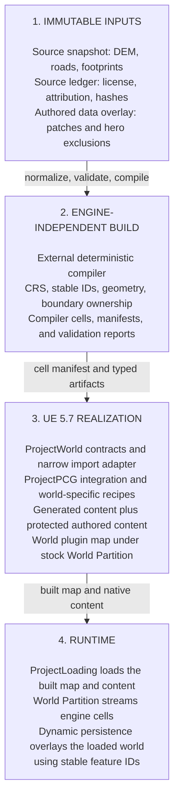
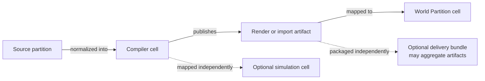

# Open World Generation Working System Map

Status: visual router for the active todo, not an architecture source of
truth. It intentionally does not repeat implementation status, decision
details, or execution tasks from the owning files.

## One-Sentence Model

ALIS should compile immutable, licensed source data into deterministic,
engine-independent world cells, then use a narrow Unreal adapter to create
disposable World Partition content while keeping authored and runtime state
separate.

## Target Relationship Map

This diagram shows proposed boundaries, not implementation status or approved
contracts. Follow the detail links below before treating a box as implemented.

## Spatial Mapping

Each arrow is an explicit mapping, not shared identity. Addressing and size
policy belongs to [audit C-04](todo.md#c-04---define-stable-identity-coordinates-and-separate-spatial-grids).

## Detail Sources

- [Implemented baseline](todo.md#c-02---correct-the-implemented-baseline)
- [Unresolved architecture decisions](todo.md#world-gate-w0---architecture-decisions)
- [Exact first-slice tasks and acceptance](first_slice.md)
- [Research reports and evidence routes](README.md#materials)

Stable component references:

- [ProjectWorld](../../../Plugins/World/ProjectWorld/README.md)
- [ProjectDefinitionGenerator](../../../Plugins/Editor/ProjectDefinitionGenerator/README.md)
- [City17](../../../Plugins/World/City17/README.md)
