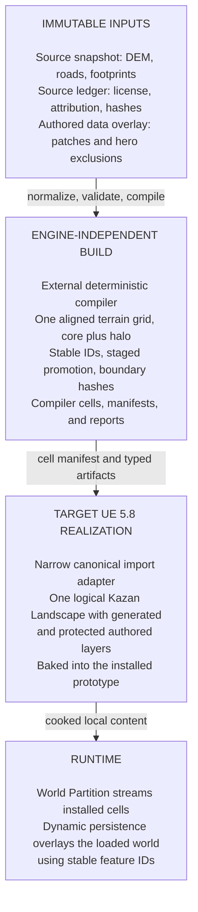
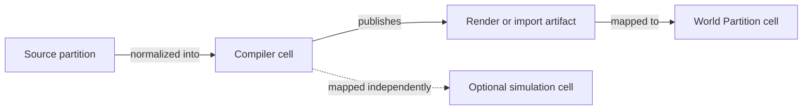

# Open World Generation Working System Map

Status: visual router for the completed task, not an architecture source of
truth. It intentionally does not repeat implementation status, decision
details, or execution tasks from the owning files.

## One-Sentence Model

ALIS should compile immutable, licensed source data into deterministic,
engine-independent world cells, then use a narrow Unreal adapter to create
disposable World Partition content while keeping authored and runtime state
separate.

## Target Relationship Map

This diagram shows proposed boundaries, not implementation status or approved
contracts. Follow the detail links below before treating a box as implemented.

## Spatial Mapping

Each arrow is an explicit mapping, not shared identity. Addressing and size
policy belongs to [audit C-04](research_audit.md#c-04---define-stable-identity-coordinates-and-separate-spatial-grids).

## Detail Sources

- [Execution router](todo.md)
- [Implemented baseline](research_audit.md#c-02---correct-the-implemented-baseline)
- [Source ingestion tasks](01_source_ingestion.md)
- [Canonical compilation tasks](02_canonical_world_compilation.md)
- [Unreal realization tasks](03_unreal_world_realization.md)
- [Cross-layer acceptance](04_end_to_end_validation.md)
- [Research reports and evidence routes](README.md#research-materials)

Stable component references:

- [ProjectWorld](../../../../Plugins/World/ProjectWorld/README.md)
- [ProjectDefinitionGenerator](../../../../Plugins/Editor/ProjectDefinitionGenerator/README.md)
- [City17](../../../../Plugins/World/City17/README.md)
