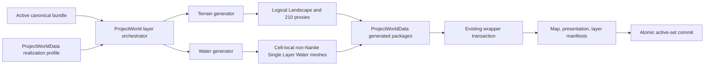

# Realize Kazan Territory Geography - Slice 3

**Status:** ACCEPTED 2026-08-20
R1, 3-PRE, 3-CORE, 3A, R2, the final Matrix, and authorized L3 enrollment
are complete. Final durable active set: `1c812c00...`.

**Prior status (superseded, retained for context):** R1, 3-PRE canonical water,
the UE 5.8 native twin, 3-CORE, production 3A realization, and R2 are accepted.
Territory Matrix/L2, L3 enrollment, and the post-enrollment operator visual
diagnostic remain before Slice 3 can close.
**Scope:** Active canonical authority -> persistent World Partition territory,
extensible generated layers, transactional enrollment, and Slice 3 evidence.
**Stable documentation owner:**
[`territory_generation.md`](../../Plugins/World/ProjectWorld/docs/territory_generation.md),
[`territory_contract.md`](../../Plugins/World/ProjectWorld/docs/territory_contract.md),
and [`world_partition.md`](../../Plugins/World/ProjectWorld/docs/world_partition.md).

## Goal

Create one persistent, approximately 1:1, georeferenced Kazan territory map
from active `kazan_territory_v1` authority. First admit one logical Landscape
and one replaceable water layer across all 210 cells. Later generators attach
through the same layer contract without reopening ownership, dirty selection,
rollback, or evidence.

## Non-goals

- No HLOD assets, actors, proxy geometry, build step, or experiment.
- No roads, vegetation, buildings, or gameplay before their 3B-3E admission.
- No buoyancy, swimming, fluid simulation, or river hydraulics in 3A.
- No runtime generation from provider payloads or loose candidates.
- No parallel manifest authority, transaction engine, test level, or framework.
- No L4 unless a shipping/cook/runtime boundary changes.

## Read first

- [Territory contract](../../Plugins/World/ProjectWorld/docs/territory_contract.md)
- [Generation SOT](../../Plugins/World/ProjectWorld/docs/territory_generation.md)
- [World Partition SOT](../../Plugins/World/ProjectWorld/docs/world_partition.md)
- [Architecture overview](../../Plugins/World/ProjectWorld/docs/architecture_overview.md)
- [MCP Editor control](../../docs/ue_engine/mcp_editor_control.md)
- [Test layers](../../docs/testing/world_pipeline_layers.md)
- [Canonical commands](../../tools/World/CanonicalCompilation/README.md)
- [World realization commands](../../scripts/ue/world/README.md)
- [Slice 2 evidence](../01_done/world/world_compile_kazan_territory_slice_2.md)

Stable docs own architecture. This todo owns only review state, execution order,
evidence, and blockers.

## Verified evidence

### Facts

1. `ProjectWorldRealizationService.h` is a bounded representative adapter with
   fixed road/building limits and counters, not per-layer territory evidence.
2. `ProjectWorldLandscapeRealization.cpp` creates one non-spatial Landscape and
   supports exact component updates, but creates no streaming proxies.
3. Launcher UE 5.8 publicly exports
   `FLandscapeConfigHelper::PartitionLandscape` from
   `%UE_PATH%/Engine/Source/Runtime/Landscape/Public/LandscapeConfigHelper.h`.
   `GridSizeInComponents=1` matches the frozen 15 x 14, one-proxy-per-component
   territory baseline without custom proxy code.
4. Active authority contains 210 terrain cells, 67,136 total features, and 115
   grouped water authorities after the accepted 3-PRE correction.
5. Fresh production comparison after the outer-edge fix reproduced the same
   water memberships/content and 169,839,314 canonical bytes, so immutable
   authority `86821a99...` remained active without needless churn.
6. Ten records are not water surfaces: seven `waterway=fairway` navigation
   lines and three `waterway=boatyard` facility geometries. Broad classification
   in `SourceIngestion/app/adapters.py` and
   `CanonicalCompilation/app/adapters.py` currently treats every
   `waterway=*` value as surface water. OSM defines
   [fairway](https://wiki.openstreetmap.org/wiki/Tag:waterway%3Dfairway) as a
   navigable route and
   [boatyard](https://wiki.openstreetmap.org/wiki/Tag:waterway%3Dboatyard) as an
   out-of-water vessel facility.
7. None of the 65 lines has source width. Unreal must not invent geographic
   width outside canonical authority.
8. After removing seven fairways, two boatyard lines, and one boatyard polygon,
   82 polygons and 56 candidate lines remain. Those 56 include 12
   `tunnel=culvert` sections with `layer=-1`, four `intermittent=yes`, four
   `intermittent=no`, no `seasonal=*`, and no width. Excluding culverts leaves
   44 visible line candidates; one culvert is also intermittent, so three
   visible candidates are explicitly intermittent. Final constants come from
   the corrected promoted bundle, not these investigation counts. The OSM
   [waterway key](https://wiki.openstreetmap.org/wiki/Key:waterway),
   [stream semantics](https://wiki.openstreetmap.org/wiki/Tag:waterway%3Dstream),
   and [culvert semantics](https://wiki.openstreetmap.org/wiki/Tag:tunnel%3Dculvert)
   confirm these modifiers affect visible-surface admission.
9. The accepted territory SOT closes `layer_kind` to generated geography,
   generated gameplay placement, protected authored overlay, and runtime-state
   exclusion. Extensibility belongs in `generator_id` and `generator_version`.
10. Polygon geometry does not imply standing water. The active bundle already
    contains river area `relation/7493502` overlapping three river centerlines
    and canal area `relation/3974314` overlapping canal centerline
    `way/263336432`. The latter contains 78 of 79 sampled centerline points.
    These records have independent feature IDs and no shared surface authority.
    OSM requires a [`water=river`](https://wiki.openstreetmap.org/wiki/Tag:water%3Driver)
    area to contain a directional `waterway=river` centerline; the equivalent
    [`water=canal`](https://wiki.openstreetmap.org/wiki/Tag:water%3Dcanal) model
    also separates area extent from flow direction.
11. UE 5.8 [labels its Water plugin experimental](https://dev.epicgames.com/documentation/unreal-engine/API/PluginIndex/Water?lang=en-US).
    Stable GeometryCore/
   GeometryAlgorithms APIs provide polygon intersection, holes, and constrained
   triangulation; core Engine provides the
   [Single Layer Water shading model](https://dev.epicgames.com/documentation/en-us/unreal-engine/single-layer-water-shading-model-in-unreal-engine)
   and StaticMesh/Nanite paths. Installed UE 5.8 code and the exact native twin
   prove Nanite rejects `MSM_SingleLayerWater`, so those two paths cannot be
   combined for water.
12. `realize_canonical_world.ps1` already owns locks, drift checks, snapshot,
    journal/recovery, commandlet execution, prospective validation, and the
    active-set-last commit. It currently publishes map and presentation only.
13. Manifest v1 admits `layer_*` IDs but lacks layer contract/generator/dirty/
    semantic identity. No tracked layer manifest exists, so no layer history
    needs compatibility migration.
14. EndToEndValidation authenticates receipts but encodes the bounded
    road/building adapter. It has no territory profile or L3 enrollment command.

### Inferences and proof gaps

- Import one logical Landscape through the proven path, then partition it with
  Epic's helper. Do not build a second tiled-import system.
- Water should be primary cell-local generated geometry, not a proxy world.
- Water geometry and hydrologic behavior are independent. A flowing polygon and
  its directional centerline must become one canonical surface group before
  clipping; otherwise Unreal can flatten the river and render a duplicate ribbon.
- Sampling terrain independently at every water vertex would create a wet skin
  that reproduces DEM cross-channel noise and standing-water undulation. Terrain
  may inform a canonical water-surface function, but cannot directly define each
  realized water vertex Z.
- Do not adopt the experimental Water actor lifecycle for the baseline. Use a
  project-owned Single Layer Water material on deterministic persistent
  non-Nanite StaticMesh assets. Keep Nanite for compatible opaque geometry.
- Synthetic proof must confirm Landscape edit-layer identity after partitioning
  and byte-stable water surface derivation, clipping, and triangulation. Failure
  stops for review; there is no ProceduralMesh, Water-plugin, or HLOD fallback.

## Architecture boundary



- ProjectWorld owns reusable schemas/loaders, DAG and generator interfaces, UE
  logic, manifest contracts, and lifecycle logic.
- ProjectWorldData owns Kazan profiles/material, actor instances, generated
  assets/maps, and durable manifests.
- ProjectWorldTestData owns the synthetic twin and disposable generated tests.
- Canonical Compilation owns surface classification, behavior/grouping, flow
  axes, and linear surface width.

## Problem

The representative path proves coordinates and transactions but cannot express
territory layers, exact per-layer package ownership, Landscape proxy topology,
territory Matrix evidence, or one L3 operation. Broad OSM classification also
admits navigation/facility geometry as water, supplies no line widths, and has no
group authority joining flowing water areas to their directional centerlines.
Starting 3A now would hard-code Kazan policy in reusable C++ or bake wrong water.

## Decision

### A. Correct water semantics before Unreal

Add explicit admission, behavior, representation, and modifiers to the compiler
profile. Generic compiler logic consumes them and rejects any unlisted class,
modifier, behavior, or ambiguous surface grouping.

| Input | Canonical result |
|---|---|
| `lake`, `pond`, or `reservoir` polygon | `surface_geometry=polygon`, `surface_behavior=standing` |
| `river` or `canal` water-area polygon plus trusted directional centerline | one group with `surface_geometry=polygon`, `surface_behavior=flowing`; polygon owns XY and centerline owns flow axis |
| Admitted linear `river`, `canal`, `stream`, `ditch`, or `drain` outside an authoritative area | `surface_geometry=ribbon`, `surface_behavior=flowing`; width resolution required |
| Other admitted polygon class | explicit profile behavior required; reject if ambiguous |
| `fairway` or `boatyard` | no visible surface; record exclusion reason |
| `tunnel=culvert`, `covered=yes`, or `location=underground` | retain lineage but exclude from visible surface |
| `intermittent=yes` or any `seasonal=*` | retain flow modifier; no permanent v1 surface until a temporal profile is admitted |
| Unknown class or modifier | reject compile |

Width resolution prefers a valid metric source width. Otherwise it requires an
operator-approved profile heuristic and records
`width_basis=profile_inferred_from_water_class`, the profile identity, and
context accuracy. No fallback numbers are frozen in R1. The 3-PRE fixture and
actual 56-line inventory must justify the table before canonical promotion;
failure to justify it blocks 3A.

Canonical Compilation groups compatible area and axis records before width
resolution, surface-Z fitting, or cell clipping. Each group has one stable
`surface_group_id` and behavior. Polygon records own their exact visible XY.
Their matched centerlines are flow-axis inputs, not overlapping render surfaces;
only centerline subreaches outside authoritative polygon coverage may become
ribbons. Grouping records all member identities and the matching rule. A flowing
polygon with no single trustworthy directional axis, conflicting axes, or an
ambiguous match is rejected in 3-PRE instead of flattened or guessed.

Canonical Compilation must also derive and persist the water-surface function
before any cell clipping:

- a standing surface group has one coherent constant level;
- a flowing surface group has one longitudinal function with level
  cross-sections, independent of polygon or ribbon representation;
- connected endpoints and every cell-edge intersection evaluate to the same
  quantized Z from either side;
- the record pins function ID/version, surface-group identity, parameters,
  terrain/source lineage, and vertical accuracy/basis.

Canonical terrain may inform that function but must not be copied per water
vertex. The exact robust estimator, connectivity rule, and longitudinal fitting
algorithm remain a mandatory 3-PRE comparison over synthetic flat/undulating
lakes, a sloped river, cell seams, and named Kazan quality features. The selected
algorithm requires operator approval before regeneration. Re-run/admit/promote
canonical authority before freezing Matrix counts or creating Unreal water.

### B. Add one small realization profile and registry

The reusable schema lives in `ProjectWorld/Data/Schemas`; concrete Kazan and
synthetic profiles live in their data owners. A profile contains:

- profile/owner/canonical/map/runtime identity;
- logical Landscape ID and components per proxy;
- layer records: `layer_id`, closed `layer_kind`, `generator_id/version`,
  dependencies,
  canonical selectors, artifact root, spatial ownership, dirty granularity,
  dependency halo, runtime mapping, and typed generator settings;
- protected authored roots and excluded runtime-state roots.

`layer_kind` is an enum containing exactly `generated_geography`,
`generated_gameplay_placement`, `protected_authored_overlay`, and
`runtime_state_exclusion`. C++ registers extensible typed generators by
complete executable tuple and rejects an unknown pair. Terrain and water are
generated geography; Slice 3A enables only those two layer IDs. Gameplay
placement stays unregistered until 3E supplies its typed object domain and
realizer.

Dirty selectors are operation inputs, not profile changes. Computed canonical
changes are unioned with operator additions and reverse dependencies. Operators
may expand but never shrink the computed closure. Current/prior canonical-cell
domains authenticate computed removals, current cells authenticate operator
additions, and halo is clipped to the real domain. First Apply dirties all;
unchanged layer inputs dirty none. Water identity hashes only canonical water
semantics consumed in that cell, not its enclosing all-feature artifact.

### C. Extend the accepted transaction

Evolve manifest v1 conditionally because no layer manifests exist. Existing
map/presentation history stays valid; each new layer manifest additionally pins:

- realization profile and normalized layer contract;
- generator ID/version and canonical/dependency inputs;
- final dirty closure and semantic output hashes.

The commandlet emits a schema-valid exact artifact inventory grouped by scope.
The wrapper verifies root containment, existence, completeness, and zero overlap;
it never infers layer ownership from filename prefixes. Physical rollback can
still snapshot broad map roots, while manifests own exact paths.

Only changed scopes advance. Delete retires a map and its layer scopes inside
the existing journaled transaction. Active-set publication remains last.

### D. Realize `kazan_main`

Import one 466 x 435 vertex logical Landscape, then call
`PartitionLandscape(..., 1)`. Require exactly 210 components/proxies, stable
cell/component mapping, spatial proxies, and one non-spatial logical owner. One
changed cell updates one component/proxy package; clean Apply updates none.

### E. Realize primary cell-local water meshes

For every surface-touched cell:

1. Consume grouped canonical surfaces. Intersect polygon-owned XY and only the
   uncovered, buffered subreaches of ribbon geometry with exact closed cell
   bounds using double-precision GeometryAlgorithms.
2. Preserve polygon holes and triangulate the already-authoritative clipped
   surface without introducing terrain-following interior Z samples.
3. Evaluate every vertex Z from the accepted canonical water-surface function,
   never from a generated Landscape lookup or independent per-vertex terrain
   sample. Any uniform anti-z-fighting render offset is a separate profile-pinned
   visual parameter, not elevation authority, and must preserve seam equality.
4. Build one deterministic non-Nanite StaticMesh and one spatial cell actor,
   assign the ProjectWorldData Single Layer Water material, and add no blocking
   collision in 3A. This is the UE 5.8-supported water path, not an authored
   LOD or HLOD exception.
5. Record surface-group and contributing member IDs plus semantic mesh digest.
   A polygon, axis, width, or function change dirties all and only the cells
   whose grouped surface output can change.

This is the primary water representation, not HLOD or far-field duplication.
The experimental Water plugin remains disabled.

### F. Add territory Matrix, one L3 command, and durable visual diagnostic

Replace fixed road/building-only validation with profile-scoped layer evidence
and authenticate the realization profile closure. Add
`kazan_territory_v1.validation.json` with a Landscape-compatible two-cell twin.
Freeze counts from corrected canonical authority and ceilings from the existing
Slice 1 budget, never from first Unreal measurements.

Add one EndToEndValidation L3 command. It authenticates current Check, selected
Matrix, validation/realization closures, and canonical authority; invokes the
existing wrapper once; audits the prospective/final authority; and writes one
receipt binding active-set/manifest hashes. It neither packages nor publishes.
Retire the manual ordering only after synthetic failure/recovery and one real
enrollment prove the replacement.

L2 remains the structural `-NullRHI` Matrix and restores its candidate package
tree. It cannot claim appearance approval. The existing packaged rendered gate
is an L4 boundary and remains deferred; do not add a retained pre-L3 candidate,
parallel capture framework, or early package run merely to obtain screenshots.

Before any L3 enrollment, realize the territory as an isolated, reversible
transient candidate, then launch UE 5.8 through the repository Editor script and
connect through the stable MCP route. Open
`/ProjectWorldData/Generated/Territory/L_ProjectWorldKazanTerritory`, reload it
once, and inspect that exact candidate without editing generated content. Use the
single existing ProjectWorldData presentation authority for overview and
terrain views; do not create a second presentation scope. Add focused MCP
viewport poses for standing water, a flowing cross-cell seam, and a technical
territory edge. Record the exact active-set/map hashes, canonical surface/cell
IDs, viewport transforms, and screenshot filenames in this todo's review
record so the operator reviews the actual current generation rather than the
August 7 representative-map captures. A visual rejection regenerates through
canonical/profile/layer authority and another transient candidate; it never
permits a hand edit to generated packages and never advances to L3. Only after
explicit operator approval does the frozen tree run the final authenticated
gates and one L3 enrollment. These screenshots are diagnostic/operator evidence,
while Matrix/L3 receipts remain acceptance authority. A post-L3 MCP pass is
optional read-only verification, not the approval checkpoint. Authenticated
packaged captures remain the later L4 responsibility.

## Rejected alternatives

- Custom Landscape proxy code/external tiled import: Epic helper already owns it.
- Experimental Water Bodies/Water Zone: new experimental lifecycle and poor fit
  for hole-rich, cell-local ownership.
- ProceduralMesh water: wrong persistence, Nanite, identity, and cook boundary.
- One actor per water feature: large river bounds defeat streaming locality.
- One whole-map manifest: cannot independently own/advance layers.
- New transaction/framework or manifest v2: no demonstrated need.

## Required invariants

1. Realize only hash-verified active canonical authority.
2. Reusable logic contains no Kazan paths, counts, material, or width policy.
3. ProjectWorld owns C++ types; ProjectWorldData owns all generated instances,
   assets, maps, and durable manifests.
4. Exactly one Landscape component and initial proxy maps to each of 210 cells.
5. Canonical 930 m cells and runtime 256 m streaming cells remain independent.
6. `layer_kind` accepts only the four SOT behavioral categories; generator
   ID/version is the extensible axis.
7. Every artifact has one owner; consumption/dependency grants no mutation right.
8. Dirty work equals computed units plus additions and transitive dependents.
9. Authored overlays/manual polish remain byte-identical in every lifecycle path.
10. Pre-commit failure restores prior bytes/authority; active set commits last.
11. Water holes, shared-edge XY/Z, and linear seams agree after quantization;
    standing surfaces are level and flowing cross-sections do not follow terrain.
    Each visible XY point has one surface-group authority: an axis never creates
    a ribbon under its group's polygon-owned area.
12. Territory artifacts/manifests contain zero HLOD output.
13. Runtime/save/replication state stays outside generated geography authority.
14. TestData binaries remain disposable; runtime ProjectWorldData stays durable.

## Implementation tasks

### R1 approval

- [x] Inspect realization, active authority, layer SOT, lifecycle, validation,
  fixtures, and launcher UE APIs.
- [x] Record the smallest production design and concrete preconditions.
- [x] Obtain operator/reviewer approval for A-F above.

### 3-PRE operator gate

Regression-first evidence is in `test_water_semantics.py`. Before production
behavior changed, its four tests failed for the expected reasons: current code
realizes non-surface/hidden/temporal records, accepts unknown semantics, has no
surface group, and does not reject missing/conflicting axes.

Authenticated current-data inventory:

- 41 permanent visible line candidates need width before polygon subtraction:
  8 river, 6 canal, 14 stream, 5 ditch, and 8 drain;
- all lack source width; 12 other candidates are hidden and 3 are intermittent;
- flowing Kazanka and Bulak area/axis pairs are exact connected chains;
- generic `water`/`cove` polygons remain fail-closed until an explicit per-feature
  behavior decision; names or proximity never silently classify them.

Operator-approved v1 policy:

| Concern | Profile-pinned policy |
|---|---|
| Standing Z | Quantized median of canonical 30 m terrain samples inside the polygon; if none exist, clip to the terrain envelope, use one OGR `PointOnSurface` bilinear sample, and record low-confidence fallback |
| Flowing Z | Sample the oriented axis every 30 m, apply a rolling five-sample median, fit a downstream non-increasing L1 isotonic profile, quantize XY/Z knots by the grid contract, and interpolate by chainage |
| Width precedence | Valid metric source `width` first; otherwise explicit `profile_inferred_from_water_class` with `heuristic_visual_not_surveyed` accuracy |
| Width fallback metres | river 12.0, canal 6.0, stream 1.5, ditch 1.0, drain 1.0 |
| Grouping | Exact profile source IDs only; resolve width first, trim against polygon authority expanded by half-width plus 0.02 m (two coordinate steps), use pinned 8-segment round buffers, and require zero final buffered-footprint overlap |

The two-sided synthetic comparison rejected the proposed along-axis Q25: mixed
positive/negative contamination changed its flowing fit by 0.7 m, versus 0.2 m
for the median. Standing median changed by at most 0.1 m for either sign and by
0.0 m for mixed contamination. The cited Q25 research applies the statistic to
associated cross-channel DSM pixels, not along-axis samples, so it does not
override this direct ALIS evidence. Linear R7 interpolation, shrinking endpoint
windows, and lower-elevation L1 tie-breaks are pinned.

The candidate real fit records Kazanka max/median correction 7.8/0.0 m, 1.6 m
total fall, and a 7,222.94 m introduced flat plateau; Bulak records 2.5/0.4 m,
2.3 m fall, and a 979.21 m plateau. These visible diagnostics are accepted v1
approximations over hydro-edited Copernicus DEM, not surveyed water elevation.
Changing the estimator or width policy creates new canonical authority.

### 3-PRE

- [x] Add compiler regressions for non-surface waterways, modifier routing,
  unknown classes/modifiers, independent geometry/behavior, polygon-axis
  grouping, ambiguous/missing-axis rejection, non-overlap, and source/heuristic
  width provenance.
- [x] Compare deterministic standing/flowing water-surface algorithms on the
  synthetic and Kazan quality set; record their level, monotonicity,
  cross-section, connectivity, seam, error, and incremental behavior.
- [x] Implement width-aware suppression and the complete-water incremental
  prepass. Prove final ribbon footprint overlap is zero and exercise
  `full -> unrelated -> grouped -> standing/ribbon dependency -> no-op`.
- [x] Regenerate two 210-cell candidates, prove D1/D2 equality, and pass
  territory admission without mutating active authority.
- [x] Obtain explicit operator approval for median Z plus the width/buffer
  policy.
- [x] Promote and authenticate the corrected buffered-membership authority.
- [x] Prove outer-edge footprint admission, authenticated terrain-halo Z,
  beyond-halo rejection, and preservation of polygon-suppressed/non-surface
  water through the complete prepass.
- [x] Prove the native Unreal half of the two-cell twin: Epic partitions the
  logical Landscape 2/2 while edit layers survive; GeometryAlgorithms preserves
  holes, water seams, footprint-only membership, and no duplicate surface; saved
  TestData water StaticMesh/Single Layer Water and opaque Nanite control assets
  reload; exact cleanup rolls disposable packages back to absence; HLOD stays 0.
- [x] Add the Landscape-compatible two-cell source/compiler fixture and profile
  with a polygon hole, undulating terrain beneath a level lake, a sloped
  cross-cell ribbon, and intermittent/culvert/non-surface routing. Unknown
  classes/modifiers remain separate fail-closed compiler regressions so the
  accepted fixture itself stays executable.
  Add a wide cross-cell river polygon with a directional centerline. Prove one
  surface group, no ribbon beneath polygon coverage, a longitudinal slope, level
  cross-sections, identical seam Z, and ribbon output only for an uncovered tail.
- [x] Extend Matrix closure/layer expectations and add the territory profile.
- [x] Implement/authenticate the L3 command and stale/tampered evidence rejects.
- [x] Before L3, open/reload the exact transient territory candidate through
  live Editor MCP and capture overview, terrain, standing-water,
  flowing-cross-cell, and technical-edge diagnostics. Bind the record to the
  candidate identity/semantic hashes and exact canonical surface/cell IDs; make
  no manual generated-content edits.
- [x] REVISED 2026-08-20, then satisfied. The gate originally read "operator
  visually approves the candidate". It existed because structural evidence once
  let a completely FLAT world pass, so a human eye was the only backstop. That
  hole is now closed by machine-checkable evidence, and the operator correctly
  observed that verifying placement from screenshots is an agent task, not a
  human one - and that building coordinate markers purely so a human can
  re-check what the agent already proved numerically is backwards.
  The agent now owns, and has proven for this candidate:

  ```text
  terrain fidelity          FINAL composed heightmap, 215040/215040, 0 mismatches, 0.0031 m
  georeference correctness  real Kazan landmarks land at their real elevations
  water placement           145/145 actors within their terrain column, none floating
  capture authenticity      fresh, exact dimensions, hashes bound, pairwise distinct
  candidate identity        captures bound to the transient candidate manifests
  absence of corruption     zero HLOD, no drifted or unowned generated content
  ```

  The HUMAN gate is narrowed to subjective appearance - does the terrain
  presentation look good, does the water look convincing, is the blockout
  aesthetically acceptable. Those questions are meaningless while the world
  wears debug materials, so they belong to the deferred presentation slice, NOT
  to this checkpoint. No coordinate-marker layer was built.
- [x] After the current-candidate correctness checkpoint passed, run the final
  authenticated gates and one authorized L3 enrollment on the frozen tree.
  Accepted enrollment: `enroll-20260820T162432Z`.

### 3-CORE

- [x] Apply the stable UE 5.8 native reuse gate from `world_partition.md`.
  Record module/API maturity and synthetic proof; custom Unreal infrastructure
  requires a concrete failed native invariant.
- [x] Add realization profile loader, generator registry, DAG/root validation,
  identity, dirty union, and dependency closure.
- [x] Close integrated-review gaps: profile execution and dirty granularity are
  contract identity; only exact terrain/water v1 tuples execute; layer roots are
  strict descendants; gameplay stays unregistered.
- [x] Enforce typed current/prior dirty domains, reject nonexistent operator
  cells, clip halo, and isolate water hashes from road/building changes.
- [x] Extend manifest v1 and wrapper for exact commandlet layer inventories.
- [x] Prove full, one-cell incremental, dependency propagation, no-op, rollback,
  interrupted recovery, Delete, and clean reconstruction on TestData.
- [x] Run the real isolated wrapper -> commandlet -> inventory -> manifest ->
  active-set L1. Run `cc979f5c28f54e16bfa37794dd8c24e7` accepted first,
  unchanged, one-cell closure, out-of-domain exact rollback, and Delete with
  zero active scopes; the outer snapshot restored TestData to absence.
- [x] Change stale `ProjectWorld.uplugin` HLOD responsibility wording to
  georeferenced realization/streaming; keep only required historical HLOD audit.

### 3A

- [x] Partition `kazan_main`; prove 210 components/proxies, 30 m spacing, exact
  cell IDs, and georeference error <= 0.01 m.
- [x] Implement deterministic water clipping, ribbons, holes, canonical surface
  Z evaluation, persistent non-Nanite Single Layer Water meshes, semantic
  evidence, and no collision.
- [x] Prove edge XY/Z, holes, excluded metadata, dirty isolation, clean rebuild,
  protected authored bytes, and zero HLOD inventory.
- [x] Run territory Apply/no-op in production-tree isolation before R2/L2
  acceptance; do not enroll persistent authority.

### Later admitted layers

- [x] Forward 3B roads, including dependency halo, to the next active numbered
  World slice derived from the roadmap.
- [x] Retain 3C instanced vegetation in the roadmap; no per-tree actors.
- [x] Retain 3D bounded building massing in the roadmap with one render and
  collision owner.
- [x] Retain 3E gameplay placement and object-level dirty regeneration in the
  roadmap.

## Test-first and verification

### Initial red evidence - closed

- The initial compiler surfaced `fairway`/`boatyard` and culverts, carried
  intermittent lines without an explicit static-surface decision, and accepted
  absent width and surface-elevation policy. It also kept flowing area polygons
  and their centerlines as unrelated features, so naive realization would have
  flattened the polygon and duplicated its covered area with a ribbon. 3-PRE
  closed these defects before Unreal realization.
- The initial tree had no profile/DAG/dirty core or exact layer manifest
  inventory. 3-CORE closed that gap.
- The initial tree had no territory realization profile. 3A now owns that
  profile and production realization; territory Matrix and L3 validation remain
  intentionally open below.

### Green evidence

Use exact L0 repeatedly. Use L1 only at these seams:

1. water policy -> corrected canonical promotion;
2. commandlet inventory -> wrapper layer manifests;
3. Landscape/water receipts -> Matrix validator;
4. accepted Matrix -> L3 command.

Mandatory proof classes:

- compiler class/modifier routing, independent geometry/behavior, one
  polygon-axis surface group, missing/ambiguous-axis rejection, zero
  polygon/ribbon overlap, uncovered-tail ribbon, width/surface-function
  provenance, standing level, flowing longitudinal/cross-section constraints,
  unknown rejection, full/incremental/clean;
- DAG missing/cycle/root escape/duplicate owner/narrowing/transitive/no-op;
- Landscape 2 x 3 synthetic, 210/210 production, actual SectionBase/canonical
  bounds, one-cell proxy-package update with an unchanged logical map,
  edit-layer survival, water-only terrain no-op, and rollback;
- water multipart/hole/cross-cell polygon and ribbon/standing level/flow
  cross-section/shared XY-Z/no duplicate surface authority/persistent
  Single Layer Water StaticMesh/exclusion/no collision/one-member dirty/clean
  equality; a separate compatible opaque control proves Nanite persistence;
- L3 stale/tamper/lock/child/manifest/recovery/commit/audit.

At the coherent boundary: one R2 review, static `plan`, one fresh Check, and only
Matrix profiles selected by `plan`; then one intentional L3 enrollment. L4 stays
deferred unless its boundary changed.

## Documentation and observability

After implementation, update the three SOTs plus their owning routers/command
READMEs. Record executable profile fields, water semantics, layer identity,
inventory ownership, L3 recovery, Landscape partitioning, and water output.
Update stable Mermaid flow/layer-DAG diagrams from landed profile/receipt names
so a fresh agent sees the operational path in 30 seconds. C4 remains system
context; Mermaid owns close-to-code flow. Stable files never reference this todo.

## Rollout and rollback

1. Correct/promote canonical water before Matrix constants.
2. Prove new machinery in disposable ProjectWorldTestData.
3. Run territory only in isolation, open that exact transient candidate through
   MCP, and stop for operator visual approval.
4. After approval, run the final selected L2 gates and one L3 through the
   existing snapshot/journal transaction. Pre-commit
   failure restores prior state; post-commit audit failure blocks later gates and
   preserves evidence for recovery.
5. Leave P0/representative and legacy maps untouched.

## Completion criteria

- R1 and R2 accepted; corrected canonical authority promoted/authenticated.
- Synthetic lifecycle and L3 failure/recovery classes pass.
- Territory proves 210 cells/components/proxies, complete admitted water,
  exact seams/holes, one surface authority per visible XY, budgets, protected
  bytes, and zero HLOD.
- `plan`, fresh Check, and only selected Matrix pass.
- The exact transient candidate is opened and reloaded through live Editor MCP;
  the operator accepts its bound diagnostic screenshots before L3.
- After approval, one L3 publishes audited map/terrain/water scopes; no-op is
  clean. This does not replace the later packaged rendered gate.
- Stable SOT/router/diagram updates match landed code with no todo references.
- No unrelated release, mirror, TestData binary, legacy map, or commit work.

## Review record

- 2026-08-13: R1 investigation completed. Proposed Epic Landscape partition,
  compiler-owned water semantics, primary cell-local water, conditional
  manifest-v1 layer identity, and one authenticated L3 command.
- 2026-08-13: Reviewer PATCH accepted after repository/data verification.
  Removed terrain-following vertex Z and numeric fallback widths, added actual
  culvert/intermittent inventory and a 3-PRE water-surface proof, and closed
  `layer_kind` to the four existing SOT categories.
- 2026-08-13: Final reviewer PATCH accepted. Active authority confirms that
  flowing river/canal polygons overlap their directional centerlines. R1 now
  separates surface geometry from behavior, requires pre-clip surface grouping,
  assigns polygon XY and centerline flow-axis roles without duplicate ribbons,
  rejects missing/ambiguous axes, and mandates a cross-cell grouped-river proof.
- 2026-08-13: R1 PASS received. Architecture is frozen and implementation moved
  to 3-PRE. Four focused semantic regressions record valid red evidence; current
  authority was authenticated/materialized read-only for estimator comparison.
- 2026-08-13: 3-PRE compiler policy implemented and promoted. Two-sided
  estimator evidence selected median over the proposed along-axis Q25. Two
  independent 210-cell runs matched across 637 deterministic files; admission,
  promotion, authority validation, and materialization accepted authority
  `kazan_territory_v1:1022a567af3ebabc6fc04175449a7a9f5dde4e64b90e057522d0645fb9b49581`.
  A later review found that this promotion preceded explicit operator approval.
- 2026-08-13: operator approved the median surface estimator, heuristic width,
  round-buffer, clearance, and strict non-overlap policy. Buffered ribbon
  footprints now own cell membership; footprint-only cells reference one
  feature-level surface authority, and width changes dirty old plus new cells.
  The installed UE 5.8 audit also froze a native-reuse gate: Runtime/Core APIs
  first, Beta GeometryAlgorithms behind the twin, and Experimental Water and
  MeshPartition excluded from Slice 3 authority.
- 2026-08-13: two final 210-cell runs shared inputs
  `f45066565b9afee46c2b8eaf43831a757253b575be7ca7881f38fbaf21d480b4`,
  matched all 637 deterministic outputs, and produced 169,839,314 canonical
  bytes in 111.059 and 111.298 seconds. All 34 production ribbons record zero
  polygon overlap. Admission and the 60-test Canonical suite passed. Promotion,
  authority validation, and materialization accepted authority
  `kazan_territory_v1:86821a9914b758e4c536f72fd549333b1953605decbb74ba9c71c2c32360809b`
  with bundle SHA-256
  `c64bfab68a4ce9c2016dbe3f8cbb6239ff7fdf514affde7ac29e563c819f361f`.
- 2026-08-14: reviewer correctly found that original-geometry pruning still
  preceded buffered membership at the outer territory edge. Red regressions
  reproduced the omission plus suppression/non-surface hazards. The fixed
  compiler classifies complete water first and uses the existing terrain halo
  only for footprint-only edge axes. A fresh 210-cell compile retained exactly
  115 water authorities, 67,136 total features, and 169,839,314 canonical
  bytes, with zero water additions, removals, membership changes, or content
  changes against active `86821a99...`; no authority promotion was warranted.
- 2026-08-14: reviewer PASS closed canonical water and authorized the native
  twin. The compiler-backed TestData profile reproduces the two-cell topology,
  holes, grouped flowing polygon/axis, uncovered tails, footprint-only
  membership, and modifier exclusions deterministically. Exact UE 5.8 tests
  prove 2/2 Epic Landscape partitioning with edit-layer survival, native water
  geometry/seams, canonical loader-to-MeshDescription behavior, valid Single
  Layer Water material compilation, opaque Nanite control persistence, semantic
  no-op identity, exact rollback, and zero HLOD. The Canonical Compilation suite
  passes 67/67. Cook, packaged runtime loading, territory Matrix, and L3 remain
  3-CORE/3A gates rather than being claimed by this twin.
- 2026-08-14: the final twin PATCH was evaluated against installed UE 5.8.
  Function ID/version now loads fail-closed at the two implemented v1 pairs,
  participates in semantic identity, and rejects v2. GeometryProcessing is
  Editor-targeted. The proposed ribbon `* 0.5` change was rejected: the exact
  production builder already realizes canonical width 12 m as 6 m per side and
  12 m total with `Offset = width_m`; halving it would create a 6 m surface.
  Focused red/green evidence and the Editor build pass, with no authority or
  generated TestData binary mutation.
- 2026-08-14: 3-CORE added owner-bound realization profiles, typed generator
  settings, DAG/root validation, authenticated dirty inputs, unit-hash diffing,
  dependency closure, and exact layer manifests on the existing transaction.
  Exact UE tests pass 1/1 for profile, dirty closure, and incremental inventory.
  World lifecycle Pester passes 58/58: 5 layer manifests, 9 transaction
  rollback, 41 manifest/recovery, and 3 operator controls. Proof includes
  external packages, semantic no-op, layer
  removal, fully absent reconstruction, partial reconstruction refusal, and
  interrupted existing/absent layer-root recovery. No Check, Matrix, L3, L4,
  production authority, or generated TestData binary was changed.
- 2026-08-14: integrated reviewer PATCH was valid in all five findings. Layer
  identity now covers semantic profile execution plus dirty granularity; exact
  terrain/water v1 tuples and strict descendant roots fail closed; dirty units
  use typed current/prior domains with clipped halos; per-cell water identity
  excludes unrelated feature changes. Exact UE profile/closure/inventory tests
  pass 1/1 each and the world lifecycle suite passes 59/59. The isolated L1 run
  `cc979f5c28f54e16bfa37794dd8c24e7` drove the real wrapper/commandlet chain,
  proved byte-exact rollback for invalid `x2`, retired all scopes on Delete,
  and restored disposable content. Reviewer PASS then unblocked 3A.
- 2026-08-14: production 3A isolation run
  `4c7307ab1afa44748bd2f1dc65d40d90` accepted full Apply, manifest-stable
  no-op, one-cell terrain-to-water dependency closure, exact rejected rollback,
  clean semantic reconstruction, and Delete. It proved 210 canonical cells,
  210 Landscape proxies, 30 m spacing, zero observed georeference error, 145
  water-cell actors, 11,914 water triangles, byte-stable protected Authored
  content, zero HLOD, and zero active scopes after Delete. The production tree
  was restored after isolation. Exact UE Landscape, water, presentation,
  GeoReferencing, and authored no-op tests pass 1/1 each; world lifecycle Pester
  passes 60/60. Changed-input regressions additionally prove that one changed
  terrain cell updates exactly one Landscape component and one changed water
  cell updates exactly one persistent water actor and semantic identity. No
  Matrix, L3, L4, persistent authority, or commit was run.
- 2026-08-14: the R2 PATCH findings were valid. Whole-bundle and per-cell
  terrain input identities no longer live on the logical Landscape; each
  component owns its terrain input while its proxy owns the canonical cell.
  The 2 x 3 native proof verifies actual SectionBase-derived bounds on both
  axes and proves a terrain-cell edit dirties only its proxy package, while a
  water-only identity change dirties no terrain package. Exact Landscape,
  Authored-layer, incremental-inventory, and persistent-water tests pass 1/1;
  lifecycle Pester passes 60/60. Production isolation run
  `c92492ae08f04c17a8b0fbd04b6d7e03` repeated the complete lifecycle with 210
  cells/proxies, 145 water actors, zero observed georeference error, zero HLOD,
  exact rollback/reconstruction, and zero scopes after Delete. The outer
  production tree was restored; no Matrix, L3, L4, persistent authority, or
  commit was run.
- 2026-08-14: the final R2 persistence finding was valid. Correctly clean
  in-memory root flags were insufficient because the outer service still
  called `SaveLevel()` for any changed Landscape component. Synthetic red run
  `074edbb4608042a6b150ff1f573e2eff` proved a genuine one-cell terrain input
  rewrote logical-map bytes. The save boundary now serializes the persistent
  level only for new/root-owned changes and otherwise saves dirty external
  packages. Accepted L1 run `abc809ad1d8543c5b41e65b2b4497229` proves cell
  `grid_24b9032e5f87005d:x1:y0` alone rewrites its exact proxy package, the
  logical map stays at SHA-256
  `16a502e36dcfc6a63b17116a0ff4fcddfda757800fd1b9df2e50fbee1ab7ef08`,
  a genuine water-only change rewrites no terrain package, and only the
  semantically changed layer manifest advances. Production isolation run
  `a299a8c0708144cf93f8fc07f192b6e5` then repeated the accepted 210-cell
  lifecycle with 210 proxies, 145 water actors, zero observed georeference
  error, zero HLOD, exact rollback/reconstruction, and zero scopes after
  Delete. The Editor build, exact Landscape native test, and lifecycle Pester
  suite pass; no Matrix, L3, L4, persistent authority, or commit was run.
- 2026-08-14: external review accepted R2 and closed 3A. A follow-up evidence
  audit found that all current territory runs were `-NullRHI` isolation runs
  whose generated trees were restored. The latest MCP/world screenshots are
  dated August 7 and show the earlier representative world, not the 210-cell
  territory; no Unreal Editor/MCP process was live during the audit. The exit
  plan at that time required a post-L3, hash-bound MCP visual diagnostic and
  explicit operator approval before archiving Slice 3 or starting 3B. L4 and its
  authenticated packaged capture remain deferred.
  SUPERSEDED 2026-08-17: the approval checkpoint is now pre-L3. The ordering is
  transient candidate -> live MCP inspection -> explicit operator approval ->
  final authenticated gates -> one L3 enrollment. A post-L3 MCP pass is optional
  read-only verification only.
- 2026-08-17: transient checkpoint preview
  `preview-20260817T111839Z` loaded the exact territory map through live UE 5.8
  MCP. The receipt reports 210 cells/proxies, 145 water actors/assets, 11,914
  triangles, 0 m observed georeference error, and zero HLOD; durable
  `active_set.json` remained byte-identical. Visual approval is blocked because
  grounded captures render a nearly uniform blue surface and detached distant
  presentation geometry. No L3 was executed.
- 2026-08-17: visual rejection diagnosed through the live UE 5.8 MCP route
  against the loaded `L_ProjectWorldKazanTerritory`. Two independent defects.
  (1) Terrain is flat. All 210 `LandscapeStreamingProxy` actors report bounds
  Z -25700..-25500, which is exactly raw heightmap value 0 under the landscape
  Z-scale of 100. Canonical `canonical/terrain/cell_x0_y0.json` carries real
  relief (46.9 m to 61.5 m) and water is realized correctly at Z 4950 (49.5 m),
  so water sheets float about 305 m above a featureless plain - the "detached
  geometry" and the flat blue field. `realization.log` proves the mechanism:
  every component logs `old CachedLocalBox Min=(Z=103.797) Max=(Z=124.797)` ->
  `new CachedLocalBox Min=(Z=-257.000) Max=(Z=-255.000)`, immediately after
  `Automatically enabling edit layers on ALandscape`. `ALandscape::Import`
  seeds only the base heightmap; the create path never seeded the generated
  base edit layer, so compositing the layer stack discarded the relief. Fixed
  by `WriteGeneratedBaseHeights` in `ProjectWorldLandscapeRealization.cpp`,
  mirroring the existing `UpdateGeneratedBase` path, plus a relief assertion in
  the native twin test. Not yet compiled or re-realized.
  (2) MCP visual evidence was unreliable. The editor viewport served
  byte-identical stale frames across camera moves, view-mode changes, realtime
  toggling, and `focus_actor`; it only refreshed after the window was forced
  foreground, and `set_camera` still failed to re-frame afterwards. Screenshot
  captures from this session must not be treated as pose-accurate, and the
  rejected preview captures are suspect for the same reason. Structural gates
  cannot detect either defect, so the checkpoint needs a terrain-relief
  assertion in addition to counts before it can be trusted.
- 2026-08-19: invariant 19 closed at its cheapest proof. Regression-first
  evidence separated two claims. The recorded symptom (`Generated/Presentation`
  missed by a snapshot) was FALSIFIED: with the pre-fix module, presentation
  rollback restored the exact path/hash set across modify, add, delete, nested
  rewrite, and whole-root deletion, and `Validate` mode writes no package at
  all, so the only mutated generated roots are map, external, declared layer,
  and presentation - all already covered. What was genuinely defective was
  structural: the presentation root was hardcoded three times
  (transaction module, wrapper, lifecycle harness), and nothing proved the
  covered set. One `Get-ProjectWorldPresentationRoot` authority now serves all
  three, `Assert-ProjectWorldSnapshotCoverage` fails a transaction closed if an
  existing presentation root is not in its record set, and six regressions pin
  the behavior (4 were RED before the change, 2 GREEN - the falsification).
  World Pester 70/70 (was 64). Isolated L1 `c263e4dbd8e347249a24211aa38c2c4c`
  drove the real wrapper/commandlet chain with the guard armed and accepted
  first_apply, unchanged_apply, one_cell_apply, rejected_rollback, and delete:
  2 cells/proxies, 2 water actors, 0 m georeference error, zero HLOD, zero
  active scopes after Delete, protected authored bytes stable, outer TestData
  tree restored. No Matrix, no L3, no territory run, no staging or commit.
- 2026-08-19: invariant 16 resolved WITHOUT touching canonical. The recorded
  premise was falsified twice over. First on scope: `0.498 / 0.111` came from
  `surface.py`'s default 40-cell head, which is columns x-1..x-3 of fifteen -
  the flattest water-dominated strip; all 210 cells measure `terrace_ratio`
  0.269, which passes, with per-cell p50 0.046 and failures concentrated in
  53 low-relief cells (mean relief 6.51 m). Second on cause: reading the raw
  Float32 Copernicus source through the pinned GDAL toolchain shows the failing
  relief band is already bit-flat at source (raw terrace 1.000, unchanged by
  the 0.1 m lattice), while quantization's only measurable effect (+0.02) lands
  on high-relief cells that pass anyway. The source declares 4.0 m vertical
  accuracy at 90% confidence. Regenerating canonical at 0.01 m would therefore
  retire the accepted authority, rewrite all 210 proxies and the R2 evidence,
  and encode precision 400x below the data's noise floor, to move a number
  rather than the surface. The `level_utilisation >= 0.20` criterion was also
  structurally invalid: it is bounded by `(relief / quantization + 1) /
  samples`, and 94 of 210 legitimate cells had a ceiling below it. Fixed the
  GATE instead: complete-by-default measurement, strided explicit subsampling,
  and `supported_level_ratio >= 0.50` (real territory 0.738; the same data on a
  0.5 m lattice 0.266, on 1.0 m 0.188). `terrace_ratio` is retained unchanged
  and independent. Five regressions pass; the accepted territory reports
  SURFACE PASSED. Pitfall 14's root-cause attribution was corrected in the same
  pass. No canonical recompile, promotion, realization, Matrix, L3, staging, or
  commit.
- 2026-08-19: invariant 18 closed at L1. The recorded defect REPRODUCED, unlike
  invariant 19. `UpdateGeneratedBase` iterated every bundle cell and filtered
  solely on the per-component `ProjectWorld.TerrainInput` tag, never reading
  `FinalDirtyUnits`; the water generator has honoured the planner all along, so
  the two layers ran on different dirtiness authorities and only terrain was
  wired backwards. The tag records the INPUT hash, so it stays truthful while
  the realized output is wrong - the exact flat-territory state - which made a
  forced rebuild the recovery path that the tag then vetoed. Reachable in
  production through `-DirtyUnit terrain=<cell>`, whose canonical hash is
  unchanged by construction. Fix is 18 lines in the one generator: it finds its
  own inventory by `GeneratorId == project_landscape` exactly as water does, and
  the tag may now suppress only work the planner did not select. With no layer
  plan there is no planner and behaviour is byte-identical to before. Proof on
  compiled builds, both directions:
  The first regression selected every cell, which a reviewer correctly found
  too weak: a mutant reading "any non-empty dirty set rebuilds everything" would
  have passed it. The committed regression is cell-local. Two non-adjacent cells
  are sabotaged and the planner names exactly one:
  RED (pre-fix generator, same test) - `two cells sabotaged mismatches=8190 ->
  planner rebuilt cell_0_0 only: mismatches=8190 components=0`, Result={Fail}.
  GREEN (fix) - `mismatches=8190 -> 4095, components=1`: exactly half recovered,
  the unselected sabotaged cell untouched, one component written. An empty
  planner selection with matching tags still writes zero components. Neighbours
  pass unchanged: FinalHeightmapAuthority, GeneratedBaseHeightAuthority,
  LandscapePartitionAndEditLayers, LandscapeProxySemanticIdentity,
  TerrainVerifierRejectsFlat, AuthoredLandscapeLayerSurvives. No compiler,
  transaction, canonical, water, or service change; no Matrix, L3, territory
  run, staging, or commit.
- 2026-08-20: FIRST TERRITORY REBUILD WITH THE RELIEF FIX, plus the first
  authenticated operator captures of a current candidate. Transient candidate
  `tmp/world/checkpoint_preview/preview-20260820T081032Z`;
  the durable active set stayed byte-identical at
  `f2f585424ab3815fd4877e159975c6d952aef84d51a517973546414c91ba9510`, so no
  production authority was enrolled. Inputs are the ACCEPTED ones, unchanged -
  compile result `c781bd87c98c63c4...`, presentation `9a15a0b200f4c860...`,
  authored overlay `e2fae4e6e95d79fa...` - so this run changes only the CODE
  path, which is exactly the intent. Apply accepted in 52.97 s: 210 canonical
  cells, 210 terrain artifacts, 291 water artifacts, zero HLOD, 0 m observed
  georeference error.
  INVARIANT 15 FINAL PROOF, on its stated acceptance surface. The Apply itself
  ran the FINAL composed-heightmap comparison over the whole territory:
  `terrain_final_height_sample_count` 215040 of 215040 expected (210 cells x
  1024 samples), `terrain_final_height_mismatch_count` 0,
  `terrain_final_height_max_error_m` 0.0031 against a 0.1 m tolerance,
  `terrain_final_relief_m` 94.296875. The SOURCE (Generated Base) comparison is
  reported separately with its own semantic hash, so these are two distinct
  comparisons rather than one relabelled.
  Supporting, NOT the proof: the fresh descriptor dump over all 210
  `LandscapeStreamingProxy` actors gives per-proxy vertical extent p50 21.90 m,
  p90 42.50 m, max 63.09 m, one proxy below 1 m (a lake cell). Territory Z spans
  45.50 m to 139.80 m; the flat candidate had ALL 210 proxies at raw height 0.
  Proxy-bounds statistics prove non-flatness only - they are a different
  statistic from canonical per-cell relief and must not be cited as fidelity.
  Nine operator views captured from `plan_vantages.py` poses derived from those
  realized bounds and independently authenticated: files exist, dimensions
  exact at 1920x1080, hashes bind the bytes, all nine pairwise distinct.
  `evidence_index.json` in the candidate root binds the views to the candidate
  identity by REFERENCE - transient scope manifest hashes, realization receipt
  hash, vantage-plan hash, per-view image hashes - without creating a second
  authority.
  Water now sits IN the terrain instead of floating about 305 m above a
  featureless plain; that specific 2026-08-17 defect is gone.
  OPERATOR DECISION PENDING: the terrain still READS flat in the frames because
  the surface is a debug checker material under a single directional light, and
  20-60 m of relief across a 930 m cell is a shallow slope. That is the
  presentation item already recorded under invariant 16 option B, not a
  realization defect - the data is measurably correct.
  DETERMINISM / NO-OP PINNED: an unchanged render-capable re-Apply against the
  same candidate reported zero dirty units for both layers, an identical
  `terrain_final_height_semantic_sha256` (`ad482be2...`), a byte-identical
  candidate active set, and left `Generated/Territory/Water/M_ProjectWorldWater.uasset`
  byte-identical. That material's single mutation during the rebuild was
  therefore one-time normalization from the previous `-NullRHI` generation to
  the render-capable envelope, not a nondeterministic write.
  FOOTPRINT: the rebuild rewrote 211 tracked generated `.uasset` files under
  `Generated/Territory` (operator committed them as `a1afc737a`). "Transient"
  describes the manifest AUTHORITY, not the content: discarding this candidate
  means restoring those bytes (revert of the generating commit), NOT deleting
  the transient manifest directory, and a Delete run retires scopes rather than
  restoring the previous candidate.
  No Matrix, no L3, no durable enrollment.
- 2026-08-20: `dev/null/` root-caused and fixed at the caller, after it
  recurred. The four files are exact Git LFS hooks written under a literal
  repo-relative `dev/null/`. Reproduced deterministically:

  ```text
  native caller (PowerShell/Windows app):
    git -c core.hooksPath=/dev/null lfs install --local
    -> "Updated Git hooks" -> creates <repo>/dev/null/{post-checkout,
       post-commit,post-merge,pre-push}

  same argument from Git Bash:
    MSYS rewrites it to "nul" -> harmless, which is why it looked safe
  ```

  Native Windows git sees no drive letter in `/dev/null`, so it resolves the
  hooks path RELATIVE TO THE REPOSITORY; git-lfs then creates that directory and
  installs into it (git-lfs issue 6297). The earlier reasoning - "the repo's
  `core.hooksPath` is `.githooks`, so nothing should land there" - was wrong,
  because a command-scoped `-c` override beats the stored config.
  Fixed the two callers this repository owns (`mirror_to_github.sh`,
  `selective.sh`): they now disable hooks by pointing at a UNIQUE per-invocation
  `mktemp -d` directory removed on exit, never `/dev/null`. Per-invocation
  matters - a fixed shared path persists between runs, so anything that ever
  dropped a hook there would be executed by every later "safe" call. Proven on
  the native-Windows path: `/dev/null` recreates `repo/dev/null`; the unique
  directory creates no `repo/dev`.
  No `.gitignore` entry, no auto-clean, no guard machinery. Any recurrence now
  implicates an EXTERNAL native caller (a git GUI or editor integration); the
  diagnostic is `git config --show-origin --show-scope --get-all core.hooksPath`
  plus `GIT_CONFIG_PARAMETERS` captured at that moment.
- 2026-08-20: georeference REALITY check, and a legibility placeholder for water.
  The operator could not judge shape without a recognisable reference, so real
  Kazan landmarks were projected WGS84 -> EPSG:32639 -> engine origin and read
  against canonical terrain. Nothing in the pipeline knows what these places
  are, yet they land where the city actually is:

  ```text
  Kazan Kremlin / Soyembika Tower   cell x1 y1    83.4 m
  Qol Sharif Mosque                 cell x1 y1    80.6 m
  Spasskaya Tower (Kremlin gate)    cell x1 y0    83.6 m
  Palace of Farmers (hill foot)     cell x1 y1    68.3 m
  Millennium Bridge (over Kazanka)  cell x2 y1    56.8 m
  Kazan Arena (low north bank)      cell x5 y3    57.0 m
  Kazan-1 railway station           cell x1 y-1   66.3 m
  water surface (reservoir/river)                 49.5 m
  ```

  Stated precisely: real Kazan coordinates land on canonical terrain in the
  expected RELATIONSHIPS - the Kremlin group highest, its foot lower, the river
  crossings near water level, water lowest. The absolute elevations were NOT
  independently sourced against a survey, so this is a relational reality check,
  not a metric one. It is still the cheapest available evidence that the world
  is the RIGHT PLACE rather than merely self-consistent, and it needs no engine
  run. A future authored-overlay
  debug layer could place named markers at these coordinates, but the numeric
  check already answers the question.
  WATER LEGIBILITY: the generated Single Layer Water material carried only
  scattering and absorption, which describe the water VOLUME. With about a
  metre of depth over a valley floor there is almost no light path to tint, so
  the surface was effectively invisible up close - an operator saw a selection
  outline and nothing inside it. A flat blue base colour and low roughness were
  added to the generated material as an explicit LEGIBILITY PLACEHOLDER; real
  water appearance stays with the deferred presentation slice, and those
  constants should become profile-driven settings there. Water settings are
  allow-listed by `HasOnlyFields`, so making them profile-driven now would have
  changed the accepted layer contract - deliberately not done.
  COST, recorded because it is not free: the material only regenerates on a
  whole-layer rebuild, so neither a plain Apply nor `-Reconstruct` picked it up
  (both correctly reported zero dirty units). A full Delete + Apply cycle was
  required, which rewrote 516 generated packages rather than one. Terrain
  evidence is unchanged across the cycle: FINAL mismatches 0, relief
  94.296875 m, zero HLOD. Deleting the material by hand was tried first and
  correctly REFUSED by the manifest integrity check as drifted content.
- 2026-08-17: pipeline audit of why every gate passed a flat territory.
  No stage validates terrain elevation. `expected_topology` in all three
  validation profiles carries only counts plus `maximum_georeferencing_error_m`;
  `MeasureCoordinateRoundTrip` probes cell corners/centres at the constant
  `Bundle.HeightOriginMeters`, so "0 m georeference error" only ever proved XY
  round-trip; `AppendLandscape` hashes edit-layer heights, which makes an
  all-zero heightmap deterministic rather than wrong; and the native twin test
  asserted partitioning and XY corners but no relief. `grep` for
  height/elevation across `tools/World/EndToEndValidation/app` and `contracts`
  returns nothing.
  The landscape generator is also gate-disjoint from the visual gate. Only two
  realization profiles exist (`kazan_territory_v1`,
  `synthetic_landscape_water_twin`), so `project_landscape` runs for the
  territory and synthetic twin maps only. The single `presentation_gate` lives
  on `representative_v1`, whose Kazan map has 19 external actors and no
  realization profile. The rendered gate and the terrain generator therefore
  never meet, which is why the August 7 representative approval never
  transferred to the territory.
  > **SUPERSEDED / FALSIFIED (2026-08-18):**
  > The diagnosis below was an intermediate hypothesis, not the final root
  > cause. Fresh exact-envelope testing later proved the Landscape source data
  > was correct. The proven cause was two conditions, both required:
  >
  > ```text
  > render-capable envelope required:
  >   -NullRHI prevented Landscape RDG composition
  >
  > commandlet completion barrier required:
  >   RequestLayersContentUpdateForceAll only requested work
  >   ForceUpdateLayersContent synchronously completed it
  > ```
  >
  > Retained only as investigation history. Do not cite it as a cause.

  The create-path gap is latent, not a regression: `Import` is followed
  directly by `AddRequiredLayers` in all of 825965348, b83f916a5, 185e02f6c,
  28fbcb300, 7c1ea9cfe, and f54a29f95. UE 5.8.1 `Landscape.cpp`
  `RegisterLandscapeActorWithProxyInternal` calls `ConvertNonEditLayerLandscape`
  at actor registration, which the log shows firing on `/Temp/Untitled_1`
  before `Import` populates components, so the default edit layer is created
  empty and composites to zero.

---

## WORLD IMPLEMENTATION PAUSED (2026-08-18)

**Reason:** run the independent agent-development-system audit before
continuing this multi-month slice. Resume from the unchecked items below only
after that process audit is reviewed and any accepted agent/process rails are
implemented.

No Check, no Matrix, no L3, nothing staged or committed by the paused session.
The `Generated/Territory` tree remains a TRANSIENT CANDIDATE, not authority.

**PROCESS PAUSE SATISFIED 2026-08-19:** independent agent-development-system
R2 PASS. This section now serves as the resume checklist.

### Resume proof traceability

Contract and column meanings:
[world_pipeline_layers.md](../../docs/testing/world_pipeline_layers.md)
section "Proof Traceability". This table governs RESUME scope: the still-open
invariants below plus the still-binding accepted invariants they depend on.
Accepted historical evidence in "Review record" is preserved as-is and is not
rewritten.

Invariant 15 did not exist before 2026-08-17. Its absence is why every
structural gate passed a flat territory: the invariant set was count-shaped,
so no proof measured relief. It is listed first deliberately.

| # | Invariant | Acceptance surface | Execution envelope | Cheapest proof | Final proof | Stop condition |
|---|---|---|---|---|---|---|
| 15 | Realized terrain relief reproduces canonical elevation | FINAL composed Landscape heightmap, NOT the Generated Base edit layer | render-capable; `-NullRHI` cannot compose edit layers, commandlet needs an explicit completion barrier | native twin relief assertion (L1) | 210-cell relief metrics vs canonical | blocks L3 |
| 16 | Canonical terrain is an acceptable SURFACE | canonical elevation samples, measured engine-independently | pure Python, no engine | `surface.py` on one cell | `surface.py` on all 210 cells (`terrace_ratio`, `supported_level_ratio`) | CLOSED 2026-08-19: 0.269 / 0.738, SURFACE PASSED on the accepted authority |
| 5 | Canonical 930 m cells stay independent of runtime 256 m streaming cells | generated world runtime hash and cell descriptors | standalone game world (`World Type = Game`), NOT Editor | descriptor inspection (L1) | territory runtime policy read-back | blocks runtime acceptance |
| 17 | Dynamic streaming locality actually unloads AND reloads | activated/resident cell and actor set over time | standalone game, native streaming-settled waits | TestData two-cell traversal | `centre -> edge -> centre` on the territory | blocks runtime acceptance |
| 12 | Territory artifacts and manifests contain zero HLOD | commandlet layer inventory | commandlet | L1 TestData inventory | territory Matrix inventory | blocks L3 |
| 10 | Pre-commit failure restores prior bytes; active set commits last | on-disk path/hash set after rollback | isolated production tree | L1 TestData rollback | territory Apply plus rejected rollback | blocks L3 |
| 18 | Planner-selected dirty work is never vetoed by a cache identity tag | the REALIZED output, not the `ProjectWorld.TerrainInput` tag | render-capable native twin | native twin sabotage + planner rebuild (L1) | one-cell forced rebuild rewrites its proxy | CLOSED 2026-08-19 at L1; territory-scale rebuild rides the next territory run |
| 19 | The transaction snapshot covers every mutated generated root | restored path/hash set, including `Generated/Presentation` | isolated production tree | L1 rollback incl. presentation root | territory rollback | blocks L3 (known debt) |
| 20 | Operator visual approval is bound to the CURRENT candidate | fresh captures bound to candidate identity and semantic hashes | live Editor MCP, render-capable, OUTSIDE `GIsAutomationTesting` comparison mode | `plan_vantages.py` vantage plan | five operator views with authenticated dimensions and freshness | blocks L3 |

Diagnostic evidence for this slice - `DIAGNOSTIC / NON-AUTHORITATIVE`, maps to
no invariant and gates nothing:

- UE 5.8 World Streaming Insights trace (experimental API; cell state,
  priority, memory).
- Editor-world frame rate. All 210 proxies and 145 water actors are resident in
  the Editor; that is a diagnostic environment, never runtime authority.
- CsvProfiler prototype `p50`/`p95` numbers. They predate 3B roads and 3D
  buildings, so they authenticate nothing about shipping performance and must
  be re-measured once that content lands.
- The removed `VisualSweep` automation test. It ran inside
  `Automation RunTests`, where `TakeHighResScreenshot` waits on screenshot
  COMPARISON against absent ground truth - the wrong execution envelope, which
  is exactly why it was removed rather than left looking green.

### Verified findings to keep

Runtime World Partition, measured on the generated territory in a standalone
game world (not the Editor):

```text
runtime World Partition initialization : proven (World Type = Game, IsGame = 1)
runtime hash                           : UWorldPartitionRuntimeHashSet (modern)
runtime grids                          : one; every descriptor RuntimeGrid:None
PlayerController streaming source      : proven (Priority 128, Local, Activated)
initial locality                       : 5 activated cells
resident runtime actors                : 4 Landscape proxies + 4 water actors
```

Compare the Editor world, where all 210 Landscape proxies and 145 water actors
are resident and the viewport runs at 3-4 FPS. **That number is an Editor
diagnostic only and is not runtime performance authority.**

Runtime prototype performance (CsvProfiler, 302 frames):

```text
FrameTime    p50 =  9.26 ms   p95 = 16.14 ms
GameThread   p50 =  3.57 ms   p95 =  6.66 ms
RenderThread p50 =  9.29 ms   p95 = 17.17 ms
GPUTime      p50 =  6.22 ms   p95 =  6.97 ms
```

Conclusion: **no performance optimization work now.** Do not treat p50 as the
product gate and do not claim large 60 FPS headroom: p95 frame time of
`16.14 ms` passes the `16.67 ms` budget only narrowly, and later world content
must remeasure. RenderThread is the leading cost.

Also verified this pass:
- `256 m / 768 m` is DOCUMENTED policy that was never applied; the territory
  currently runs on World Partition defaults. See `world_partition.md`.
- UE 5.8 native tooling survey recorded in `world_partition.md`, including
  World Streaming Insights and FastGeo Streaming (experimental, deferred).
- Canonical terrain terracing is real and measured; see the decision item below.

### Runtime World Partition acceptance

- [x] Forward the territory's real HashSet-native runtime policy to roadmap
      Slice 4 after roads and buildings materially change runtime content.
      `256 m / 768 m`
      is currently docs-only. Either apply it through a territory runtime
      profile and read it back from the generated world, or explicitly revise
      the policy against measured UE 5.8 defaults. Do not recreate
      `UWorldPartitionRuntimeSpatialHash`.
- [x] Forward `centre -> edge -> centre` runtime unload/reload proof to roadmap
      Slice 4. It must use native streaming-settled waits and
      demonstrate actual cell/proxy/water unload AND reload, not merely moving
      the streaming source. Initial-spawn locality is proven; dynamic locality
      is not.
- [x] Forward one UE 5.8 World Streaming Insights trace for cell state,
      priority and memory. Diagnostics only; its API is experimental.
- [x] Forward Game/Render/GPU/Frame **p95** remeasurement until 3B roads and 3D buildings
      materially increase runtime content. Until then no optimization task
      exists.

### Visual / operator checkpoint

The `Project.World.Realization.Territory.VisualSweep` automation test was
REMOVED this pass rather than left as a green-looking evidence path. It used
the wrong execution envelope: inside `Automation RunTests`,
`GIsAutomationTesting` is true, so `TakeHighResScreenshot` waits on
`OnScreenshotCompared` (screenshot COMPARISON against absent ground truth)
instead of capture, and the run additionally burns the full 600 s
`FWaitForInteractiveFrameRate` gate. Details in ProjectWorld pitfall 13.

Aspect-correct vantage planning survives in
`tools/World/VisualVerification/app/plan_vantages.py`, which runs green.

- [x] Capture route implemented and proven 2026-08-19. `ProjectWorld.CaptureEvidence`
      console command + `capture_visual_evidence.ps1` render the planned
      vantages through a transient `USceneCaptureComponent2D` into its own
      render target: no viewport, no window, no `GIsAutomationTesting`
      comparison path, nothing saved. The vantage plan now carries capture
      width/height/FOV so the framing solve and the capture cannot disagree.
      `verify_capture.py` authenticates independently of the engine - PNG
      headers re-read, files re-hashed (12 regressions green).
      ENVELOPE: the live editor with `-RenderOffscreen -unattended`, NOT a
      commandlet. The commandlet envelope was tried and abandoned on measured
      evidence; see ProjectWorld pitfall 15 for what was verified true while
      the frames stayed black.
      PROVEN on the existing candidate: 3 poses at 1280x720 and 3 at 1920x1080,
      all `CAPTURE AUTHENTICATED` - files exist, dimensions exact, hashes bind
      the bytes, poses pairwise distinct. The repeated-pose control is REPORTED,
      not gated: UE carries temporal rendering state, so byte-identical repeats
      are not a property healthy imagery has.
      The captured imagery correctly shows the STALE candidate - flat terrain
      with water sheets floating above it, exactly the 2026-08-17 rejection.
      That is route proof, NOT operator evidence: the candidate predates the
      relief fix and has never been re-realized.
      IDENTITY BINDING: the wrapper refuses a receipt whose `map_package` is not
      the requested map. Reviewer-found and proven by negative test - requesting
      a nonexistent territory map left the editor on its fallback world and
      produced three distinct, correctly sized, `status=accepted` captures OF
      CITY17. Authenticated frames of the wrong world are the one way this route
      could still mislead an operator; it now exits 1 and names both maps.
      Capture paths containing spaces are also refused, because the console
      splits command arguments on whitespace.
- [x] Produced 2026-08-20 from the rebuilt candidate: aspect-correct overview,
      four opposing obliques, three water-cluster views, one high-relief view.
      The water views' standoff offsets remain heuristic, not derived.
- [x] Authenticated 2026-08-20: files exist, exact 1920x1080, hashes bind the
      bytes, all nine pairwise distinct, receipt bound to the requested map.

### Known correctness debt discovered during this investigation

- [x] Resolve the duplicated dirtiness authority. Closed 2026-08-19. The defect
      reproduced exactly as recorded: `UpdateGeneratedBase` consulted only the
      per-component `ProjectWorld.TerrainInput` tag and never read
      `FinalDirtyUnits`, while the sibling water generator already honoured the
      planner. Terrain now defers to the planner and the tag may suppress only
      work the planner did NOT select. Absent a layer plan behaviour is
      unchanged.
- [x] Fix transaction snapshot scope before another destructive territory run.
      Resolved 2026-08-19. The presumed defect did NOT reproduce: byte-exact
      presentation rollback already worked in every mutation shape, so the real
      gaps were a duplicated root literal and an unproven covered set. There is
      now one presentation-root authority, a fail-closed coverage guard inside
      the snapshot, and committed regressions. The invariant-19 FINAL proof
      (territory rollback) still rides on the next territory run.
- [x] Removed 2026-08-19. `ProjectWorldTerrainMatrixTests.cpp` loaded the
      territory compile result from a hardcoded `tmp/world/canonical_compilation/
      materialized/...` path. Its A-D discriminator existed to separate the
      flat-territory failure classes; that cause is proven and the surviving
      relief proofs (`FinalHeightmapAuthority`, `GeneratedBaseHeightAuthority`,
      `TerrainVerifierRejectsFlat`) need no materialized cache. Deleted rather
      than re-fixtured: no replacement framework, fixture, or durable cache.
      Editor builds and the terrain proofs pass unchanged. The only remaining
      `tmp/` string in committed World tests is a fail-closed path-rejection
      fixture that is never read.

### Canonical visual-quality decision - RESOLVED 2026-08-19

**Decision: retain canonical. `height_quantization` stays 0.1 m and no new
canonical authority is produced.** The premise below was wrong; it is preserved
because the reasoning about gate scope is still the durable lesson.

> **SUPERSEDED 2026-08-19.** Both figures were gate artifacts, not terrain:
> `surface.py` defaulted to the first 40 filenames, which is three of fifteen
> territory columns - a contiguous strip of the flattest, water-dominated
> ground - and `level_utilisation` was compared against an absolute floor that
> is unreachable at low relief. Over all 210 cells the territory measures
> `terrace_ratio` 0.269, which PASSES, and 94 of 210 cells had a
> `level_utilisation` CEILING below the 0.20 gate.

```text
terrace_ratio       = 0.498   (40 of 210 cells, biased sample)
level_utilisation   = 0.111   (structurally unreachable gate)
height_quantization = 0.1 m
```

Roughly half of adjacent canonical samples are bit-identical, producing flat
plateaus separated by 10 cm cliffs; that is the corduroy banding seen in
operator review.

Gate ownership, stated precisely:

```text
realization height gate = realization FIDELITY
    "does Unreal faithfully realize canonical elevation?"
    Correctly answered yes. Deriving its tolerance from height_quantization is
    correct for that question - it must not flag differences finer than the
    data's own precision.

surface.py = canonical SURFACE QUALITY
    "is canonical terrain itself acceptable as a surface?"
    A separate acceptance dimension that did not previously exist.
```

The fidelity gate is not defective and was not bypassed. The failure was a
MISSING ACCEPTANCE DIMENSION, compounded by reporting a fidelity result as
though it proved terrain correctness. `surface.py` adds the missing dimension by
measuring canonical directly, independent of the engine.

- [x] Resolved 2026-08-19: accept canonical, correct the gate. Quantization is
      NOT the cause. Measured on the raw Float32 Copernicus source in 32x32
      blocks, before and after applying the 0.1 m lattice:

      ```text
      relief band   blocks   raw source   at 0.1 m   delta
      0-3 m              6      1.000       1.000    +0.000
      3-10 m            11      0.932       0.934    +0.002
      10-25 m           28      0.378       0.397    +0.019
      25+ m             32      0.002       0.025    +0.023
      ```

      In exactly the cells that fail (53 of 210, mean relief 6.51 m against
      23.42 m territory-wide) the source is already bit-flat and quantization
      adds nothing; GLO-30 hydro-flattens water and plateaus void-filled
      ground. Source vertical accuracy is 4.0 m at 90% confidence, so 0.1 m is
      already 40x finer than the data's own accuracy. A finer lattice cannot
      recreate variation the source does not contain, so no three-cell 0.01 m
      trial was run. Canonical authority is UNCHANGED - nothing was recompiled,
      promoted, or realized by this decision.
- [x] Correct the acceptance gate instead. `surface.py` now measures every cell
      by default and strides an explicit subsample; the absolute
      `level_utilisation >= 0.20` gate is replaced by
      `supported_level_ratio >= 0.50`, which is distinct levels over
      `min(relief / declared quantization + 1, samples)` and is therefore
      scale-free. `terrace_ratio <= 0.45` is retained unchanged as the
      independent repeated-sample signal. Threshold chosen from measured
      separation: the real territory scores 0.738, the same data re-emitted on
      a 0.5 m lattice scores 0.266 and on 1.0 m scores 0.188. Five regressions
      in `tools/World/VisualVerification/tests/test_surface.py` pin low-relief
      acceptance, undelivered-resolution rejection, terrace independence, and
      complete/strided sampling. The accepted territory now reports
      `terrace_ratio 0.269 / supported_level_ratio 0.738 - SURFACE PASSED`.
- [x] Defer residual appearance work to the presentation owner: banding in
      low-relief water-adjacent ground is addressed by terrain material detail
      normals, which change no elevation. Not a canonical or realization task.

## Final closure evidence - 2026-08-20

- Common Check: `check-20260820T160541Z`, accepted.
- Territory Matrix: `run-20260820T160902Z`, accepted against the final code
  closure and unchanged canonical authority `86821a99...`.
- Existing P0 and representative durable scopes were refreshed from accepted
  Matrices `run-20260820T153250Z` and `run-20260820T153846Z`; their shared
  presentation bytes and current generator fingerprint agree.
- Authorized L3 enrollment: `enroll-20260820T162432Z`, accepted. It advanced
  active authority from `45d83881...` to `1c812c00...` and enrolled exactly
  map, terrain, and water territory scopes.
- Final audit: `Saved/Validation/WorldAuthority/slice3-final-audit.json`,
  accepted with six scopes, 556 byte-identical owned artifacts, zero unowned
  files, zero ownership conflicts, current generator fingerprint, and no
  pending journal.
- Territory scope: 210 terrain artifacts, 291 water artifacts, and 15 map
  artifacts. All 516 territory artifacts are tracked, present, and LFS-owned;
  `git lfs fsck` passes.
- Enrollment child-evidence routing defect was reproduced before mutation,
  fixed at the orchestrator boundary, and pinned by
  `test_wrapper_receipt_uses_realization_evidence_root`; all four enrollment
  unit tests pass.
