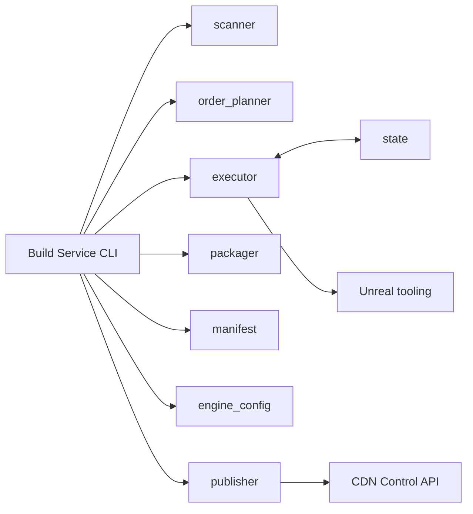

# Build Service Main Diagram

```mermaid
flowchart LR
    CLI[Build Service CLI]
    Scan[scanner]
    Plan[order_planner]
    Exec[executor]
    State[state]
    Pack[packager]
    Manifest[manifest]
    Engine[engine_config]
    Publish[publisher]
    UE[Unreal tooling]
    CDN[CDN Control API]

    CLI --> Scan
    CLI --> Plan
    CLI --> Exec
    Exec <--> State
    Exec --> UE
    CLI --> Pack
    CLI --> Manifest
    CLI --> Engine
    CLI --> Publish
    Publish --> CDN
```
