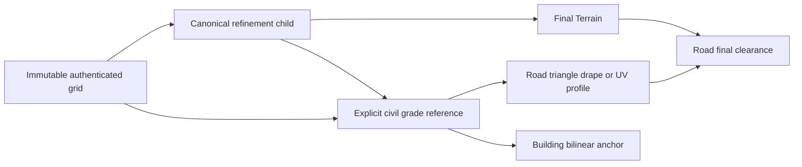

# Immutable civil grade consumption

```mermaid
flowchart LR
    B[Immutable authenticated grid] --> C[Canonical refinement child]
    C --> F[Final Terrain]
    C --> G[Explicit civil grade reference]
    B --> G
    G --> R[Road triangle drape or UV profile]
    G --> A[Building bilinear anchor]
    F --> V[Road final clearance]
    R --> V
```
