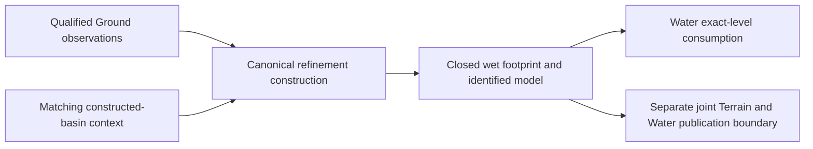

# Contained standing Water construction

```mermaid
flowchart LR
    G[Qualified Ground observations] --> C[Canonical refinement construction]
    O[Matching constructed-basin context] --> C
    C --> P[Closed wet footprint and identified model]
    P --> W[Water exact-level consumption]
    P --> J[Separate joint Terrain and Water publication boundary]
```
