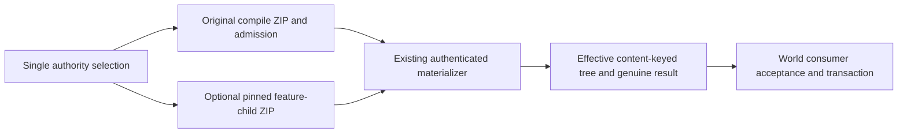

# Effective base and child materialization

```mermaid
flowchart LR
    A[Single authority selection] --> B[Original compile ZIP and admission]
    A --> C[Optional pinned feature-child ZIP]
    B --> M[Existing authenticated materializer]
    C --> M
    M --> E[Effective content-keyed tree and genuine result]
    E --> W[World consumer acceptance and transaction]
```
