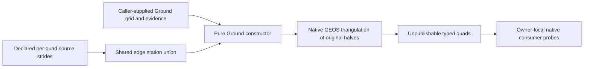

# Finite Ground resolution closure

```mermaid
flowchart LR
    G[Caller-supplied Ground grid and evidence] --> P[Pure Ground constructor]
    N[Declared per-quad source strides] --> U[Shared edge station union]
    U --> P
    P --> T[Native GEOS triangulation of original halves]
    T --> D[Unpublishable typed quads]
    D --> V[Owner-local native consumer probes]
```
