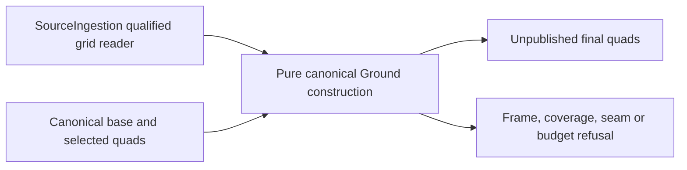

# Pure Ground construction

```mermaid
flowchart LR
    S[SourceIngestion qualified grid reader] --> G[Pure canonical Ground construction]
    B[Canonical base and selected quads] --> G
    G --> Q[Unpublished final quads]
    G --> R[Frame, coverage, seam or budget refusal]
```
