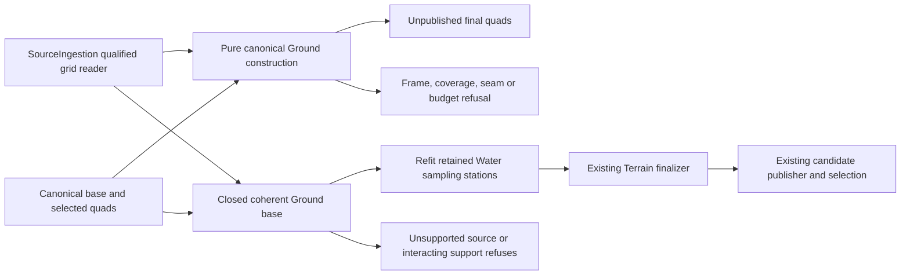

# Pure Ground construction

```mermaid
flowchart LR
    S[SourceIngestion qualified grid reader] --> G[Pure canonical Ground construction]
    B[Canonical base and selected quads] --> G
    G --> Q[Unpublished final quads]
    G --> R[Frame, coverage, seam or budget refusal]
    S --> C[Closed coherent Ground base]
    B --> C
    C --> W[Refit retained Water sampling stations]
    W --> T[Existing Terrain finalizer]
    T --> P[Existing candidate publisher and selection]
    C --> X[Unsupported source or interacting support refuses]
```
