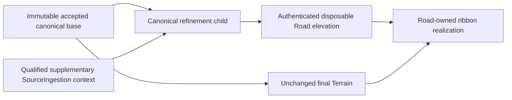

# Qualified Road candidate preparation

```mermaid
flowchart LR
    B[Immutable accepted canonical base] --> C[Canonical refinement child]
    S[Qualified supplementary SourceIngestion context] --> C
    C --> P[Authenticated disposable Road elevation]
    P --> R[Road-owned ribbon realization]
    B --> T[Unchanged final Terrain]
    T --> R
```
