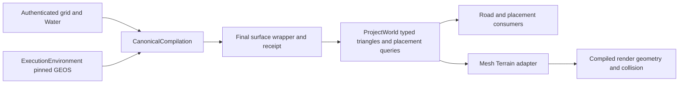

# Sparse terrain realization

```mermaid
flowchart LR
    B[Authenticated grid and Water] --> C[CanonicalCompilation]
    E[ExecutionEnvironment pinned GEOS] --> C
    C --> S[Final surface wrapper and receipt]
    S --> Q[ProjectWorld typed triangles and placement queries]
    Q --> R[Road and placement consumers]
    Q --> M[Mesh Terrain adapter]
    M --> F[Compiled render geometry and collision]
```
