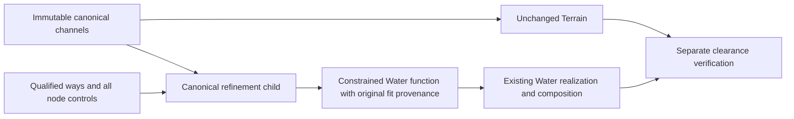

# Source-node Water confluence construction

```mermaid
flowchart LR
    B[Immutable canonical channels] --> C[Canonical refinement child]
    S[Qualified ways and all node controls] --> C
    C --> W[Constrained Water function with original fit provenance]
    W --> R[Existing Water realization and composition]
    B --> T[Unchanged Terrain]
    T --> V[Separate clearance verification]
    R --> V
```
